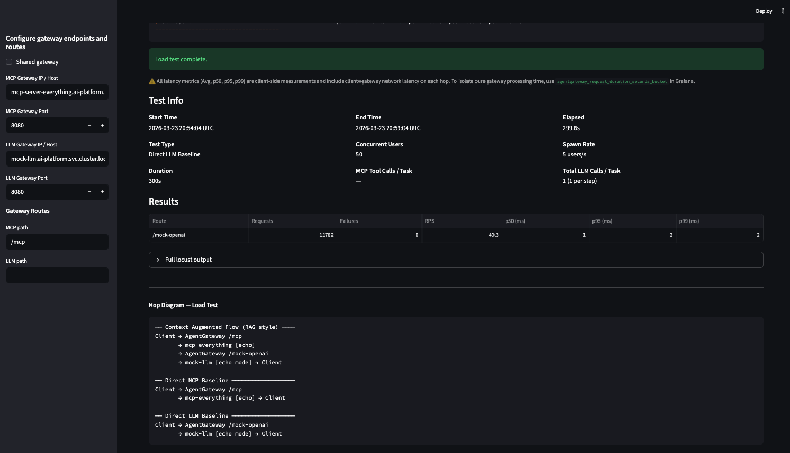
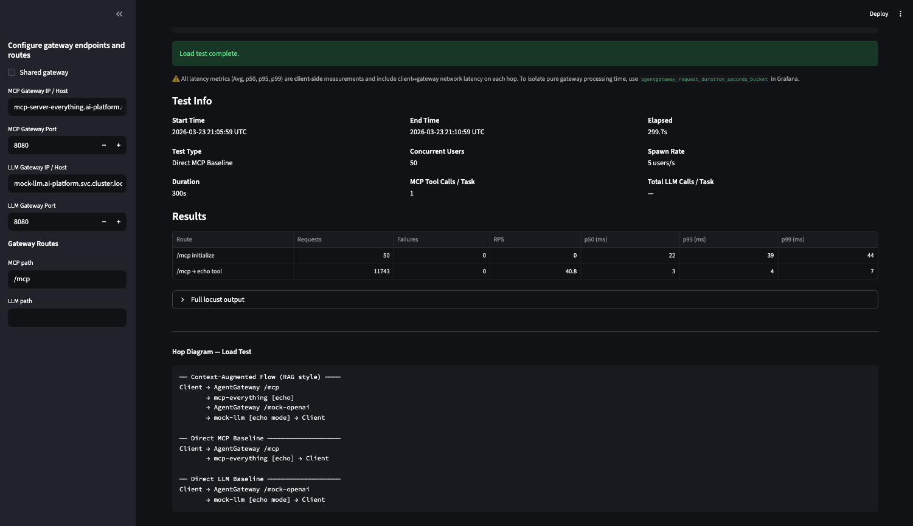

# Baseline Results
Duration 300 seconds (5 mins)
LLM Payload size: 256 B
MCP Payload Size: 32 KB

- Direct LLM Baseline (1x LLM call)
- Direct MCP Baseline (1x MCP tool call)
- Full Chain
    - Standard Tool Use Flow
        - 1x LLM call + 2x MCP Tool Calls x 1x LLM call
    - Context-Augmented Flow (RAG style)
        - 2x MCP tool calls x 1x LLM call

# Direct LLM Baseline (5-min)


```
Response time percentiles (approximated)
Type     Name                                                                                  50%    66%    75%    80%    90%    95%    98%    99%  99.9% 99.99%   100% # reqs
--------|--------------------------------------------------------------------------------|--------|------|------|------|------|------|------|------|------|------|------|------
POST     /mock-openai                                                                            1      1      1      1      2      2      2      2     12     15     20  11782
--------|--------------------------------------------------------------------------------|--------|------|------|------|------|------|------|------|------|------|------|------
         Aggregated                                                                              1      1      1      1      2      2      2      2     12     15     20  11782


=== Agentgateway Loadgen — Summary ===
Start:   2026-03-23 20:54:04 UTC
End:     2026-03-23 20:59:04 UTC
Elapsed: 299.6s
------
/mock-openai                                        reqs=11782  fails=   0  p50=1.00ms  p95=2.00ms  p99=2.00ms
=====================================
```

# Direct MCP Baseline (5 min)

```
Response time percentiles (approximated)
Type     Name                                                                                  50%    66%    75%    80%    90%    95%    98%    99%  99.9% 99.99%   100% # reqs
--------|--------------------------------------------------------------------------------|--------|------|------|------|------|------|------|------|------|------|------|------
POST     /mcp initialize                                                                        22     26     28     31     36     39     44     44     44     44     44     50
POST     /mcp → echo tool                                                                        3      3      3      3      4      4      5      7     16     23     25  11743
--------|--------------------------------------------------------------------------------|--------|------|------|------|------|------|------|------|------|------|------|------
         Aggregated                                                                              3      3      3      4      4      4      6      9     31     39     44  11793


=== Agentgateway Loadgen — Summary ===
Start:   2026-03-23 21:05:59 UTC
End:     2026-03-23 21:10:59 UTC
Elapsed: 299.7s
------
/mcp initialize                                     reqs=   50  fails=   0  p50=22.00ms  p95=39.00ms  p99=44.00ms
/mcp → echo tool                                    reqs=11743  fails=   0  p50=3.00ms  p95=4.00ms  p99=7.00ms
=====================================
```

# Full Chain - Standard Tool Use Flow (5 mins)


```
Response time percentiles (approximated)
Type     Name                                                                                  50%    66%    75%    80%    90%    95%    98%    99%  99.9% 99.99%   100% # reqs
--------|--------------------------------------------------------------------------------|--------|------|------|------|------|------|------|------|------|------|------|------
POST     /mcp initialize                                                                        18     20     21     22     27     31     40     40     40     40     40     50
POST     /mcp → echo tool                                                                        3      3      3      3      3      4      5      6     13     16     17  11798
POST     /mock-openai → initial prompt                                                           2      2      2      2      2      2      3      3     11     17     17  11798
POST     /mock-openai → tool result summary                                                      2      2      2      2      2      3      3      3      4     15     15  11798
CHAIN    [full chain] standard tool-use                                                          6      7      7      7      8      8     10     11     22     25     25  11798
--------|--------------------------------------------------------------------------------|--------|------|------|------|------|------|------|------|------|------|------|------
         Aggregated                                                                              2      3      5      6      7      7      8      9     19     27     40  47242


=== Agentgateway Loadgen — Summary ===
Start:   2026-03-23 21:13:42 UTC
End:     2026-03-23 21:18:42 UTC
Elapsed: 299.6s
------
/mcp initialize                                     reqs=   50  fails=   0  p50=18.00ms  p95=31.00ms  p99=40.00ms
/mock-openai → initial prompt                       reqs=11798  fails=   0  p50=2.00ms  p95=2.00ms  p99=3.00ms
/mcp → echo tool                                    reqs=11798  fails=   0  p50=3.00ms  p95=4.00ms  p99=6.00ms
/mock-openai → tool result summary                  reqs=11798  fails=   0  p50=2.00ms  p95=3.00ms  p99=3.00ms
[full chain] standard tool-use                      reqs=11798  fails=   0  p50=6.00ms  p95=8.00ms  p99=11.00ms
=====================================
```

# Full Chain - Context-Augmented Flow (5 mins)


```
Response time percentiles (approximated)
Type     Name                                                                                  50%    66%    75%    80%    90%    95%    98%    99%  99.9% 99.99%   100% # reqs
--------|--------------------------------------------------------------------------------|--------|------|------|------|------|------|------|------|------|------|------|------
POST     /mcp initialize                                                                        17     21     21     23     26     28     39     39     39     39     39     50
POST     /mcp → echo tool                                                                        3      3      3      3      3      4      4      6     16     20     25  11807
POST     /mock-openai                                                                            2      2      2      2      2      2      3      3      8     27     32  11807
CHAIN    [full chain] context-augmented flow                                                     4      5      5      5      5      6      7      8     20     36     40  11807
--------|--------------------------------------------------------------------------------|--------|------|------|------|------|------|------|------|------|------|------|------
         Aggregated                                                                              3      4      4      4      5      5      6      7     20     35     40  35471


=== Agentgateway Loadgen — Summary ===
Start:   2026-03-23 21:30:24 UTC
End:     2026-03-23 21:35:24 UTC
Elapsed: 299.6s
------
/mcp initialize                                     reqs=   50  fails=   0  p50=17.00ms  p95=28.00ms  p99=39.00ms
/mcp → echo tool                                    reqs=11807  fails=   0  p50=3.00ms  p95=4.00ms  p99=6.00ms
/mock-openai                                        reqs=11807  fails=   0  p50=2.00ms  p95=2.00ms  p99=3.00ms
[full chain] context-augmented flow                 reqs=11807  fails=   0  p50=4.00ms  p95=6.00ms  p99=8.00ms
=====================================
```