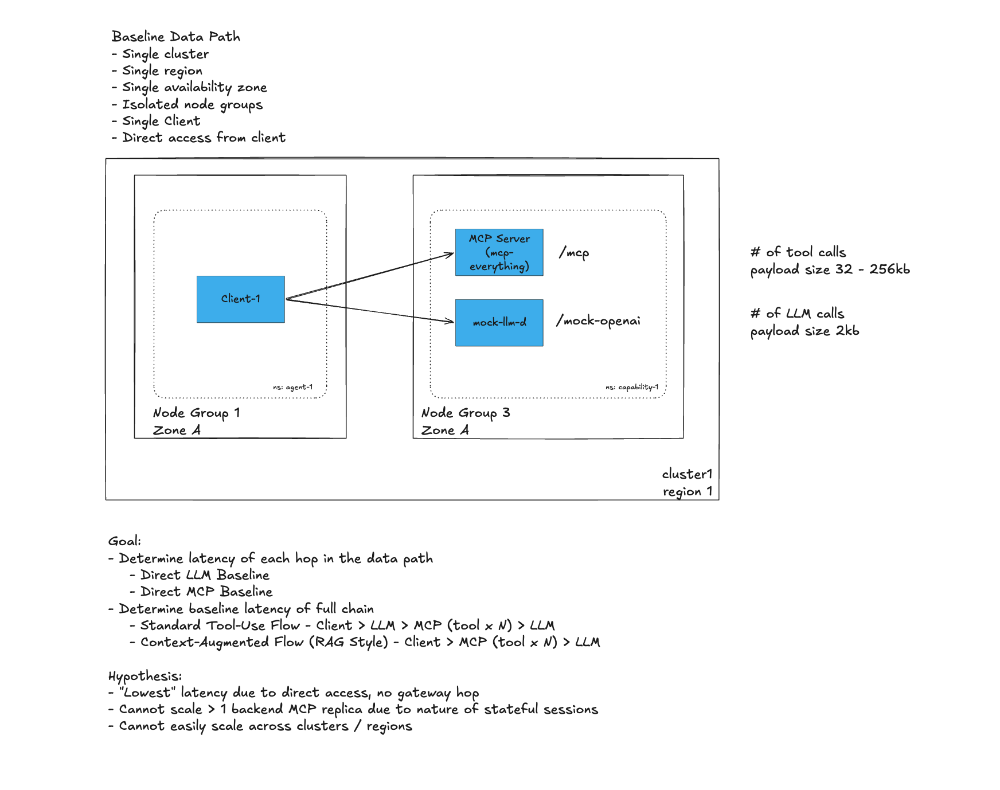
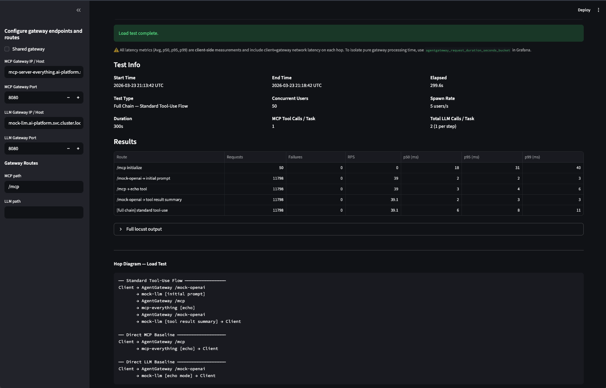
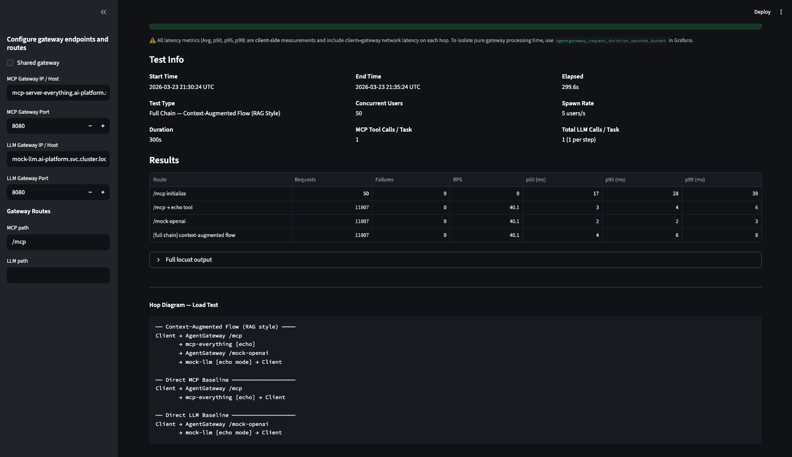

# Baseline: Direct LLM and MCP — No Proxy

> **Goal**: Establish baseline latency for each hop in the data path with no proxy overhead — direct LLM calls, direct MCP calls, and full agentic chains. Results serve as the reference point for evaluating proxy latency add across all scenarios.
>
> **Hypothesis**: Lowest possible latency — no gateway overhead.
>
> **Flows tested**:
> - Direct LLM Baseline
> - Direct MCP Baseline
> - Standard Tool-Use Flow: Client > LLM > MCP (tool x N) > LLM
> - Context-Augmented Flow (RAG Style): Client > MCP (tool x N) > LLM

## Architecture

> Single cluster · Single region · Single AZ · Isolated node groups · Single client · No proxy



## Components

| Component | Replicas | Notes |
|-----------|----------|-------|
| `agent` | 1 | Locust load test client |
| `mcp-server-everything` | 1 | Reference MCP server — scaled to 1 replica for direct tests (session stickiness) |
| `mock-llm-d` | 1 | Mock OpenAI-compatible LLM inference service (llm-d-inference-sim) |

> **Note:** `mcp-server-everything` must be scaled to 1 replica for baseline tests. Without Agentgateway handling session pinning, Kubernetes load-balances round-robin across pods — an `initialize` call may hit pod A while subsequent `tools/call` requests hit pod B, which has no session record and returns 400.

---

## Prerequisites

Complete the following steps before running this scenario:

1. Create the GKE cluster — follow [`gke/main-cluster-gke.md`](../gke/main-cluster-gke.md)

Additionally ensure the following are available:
- `kubectl` configured against the target cluster
- Python 3.11+

---

## Quick Start

```bash
chmod +x setup-script.sh
./setup-script.sh
```

The script walks through the following steps interactively:
1. Deploy mcp-server-everything (1 replica) + mock-llm-d to `ai-platform` namespace
2. Set up port-forwards (`localhost:8080` → MCP, `localhost:8081` → LLM)
3. Set up Python virtual environment
4. Launch Streamlit UI

---

## Test Steps

### 1. Scale MCP to a single replica

```bash
kubectl scale -n ai-platform deploy/mcp-server-everything --replicas 1
```

> **Why?** The MCP server does not share session state across replicas. With multiple pods the Kubernetes Service load-balances round-robin, so an `initialize` call may land on pod A while subsequent `tools/call` requests hit pod B (which has no session and returns 400). Agentgateway handles session pinning automatically, but when bypassing it you must run a single replica.

### 2. Configure the Streamlit UI

- Un-select the **Shared Gateway** checkbox.
- Enter the direct backend addresses (bypass Agentgateway):

| Service | Host | Port | Path |
|---------|------|------|------|
| MCP | `mcp-server-everything.ai-platform.svc.cluster.local` | `8080` | `/mcp` |
| LLM | `mock-llm.ai-platform.svc.cluster.local` | `8080` | *(leave blank)* |

### 3. Run tests

| Parameter | Value |
|-----------|-------|
| Concurrent users | 50 |
| Spawn rate | 5 users/s |
| Duration | 300s (5 min) |
| LLM payload size | 256 B |
| MCP payload size | 32 KB |

Execute each test in order:

1. **Direct LLM Baseline** — 1x LLM call
2. **Direct MCP Baseline** — 1x MCP tool call
3. **Full Chain — Standard Tool-Use Flow** — 1x LLM call + 2x MCP tool calls + 1x LLM call
4. **Full Chain — Context-Augmented Flow (RAG Style)** — 2x MCP tool calls + 1x LLM call

### 4. After each test

Rollout restart the backend servers to reset state:

```bash
kubectl rollout restart -n ai-platform deployment mcp-server-everything
kubectl rollout restart -n ai-platform deployment mock-llm
```

---

## Results

**Test parameters:** Duration 300 s (5 min) · LLM payload 256 B · MCP payload 32 KB

### Direct LLM Baseline (5 min)


| Endpoint | Reqs | Fails | p50 | p95 | p99 |
|----------|------|-------|-----|-----|-----|
| /mock-openai | 11,782 | 0 | 1ms | 2ms | 2ms |

**Duration:** 4m 59s (2026-03-23 20:54:04 UTC → 2026-03-23 20:59:04 UTC)

### Direct MCP Baseline (5 min)


| Endpoint | Reqs | Fails | p50 | p95 | p99 |
|----------|------|-------|-----|-----|-----|
| /mcp initialize | 50 | 0 | 22ms | 39ms | 44ms |
| /mcp → echo tool | 11,743 | 0 | 3ms | 4ms | 7ms |

**Duration:** 4m 59s (2026-03-23 21:05:59 UTC → 2026-03-23 21:10:59 UTC)

### Full Chain — Standard Tool-Use Flow (5 min)



| Endpoint | Reqs | Fails | p50 | p95 | p99 |
|----------|------|-------|-----|-----|-----|
| /mcp initialize | 50 | 0 | 18ms | 31ms | 40ms |
| /mock-openai → initial prompt | 11,798 | 0 | 2ms | 2ms | 3ms |
| /mcp → echo tool | 11,798 | 0 | 3ms | 4ms | 6ms |
| /mock-openai → tool result summary | 11,798 | 0 | 2ms | 3ms | 3ms |
| [full chain] standard tool-use | 11,798 | 0 | 6ms | 8ms | 11ms |

**Duration:** 4m 59s (2026-03-23 21:13:42 UTC → 2026-03-23 21:18:42 UTC)

### Full Chain — Context-Augmented Flow (5 min)



| Endpoint | Reqs | Fails | p50 | p95 | p99 |
|----------|------|-------|-----|-----|-----|
| /mcp initialize | 50 | 0 | 17ms | 28ms | 39ms |
| /mcp → echo tool | 11,807 | 0 | 3ms | 4ms | 6ms |
| /mock-openai | 11,807 | 0 | 2ms | 2ms | 3ms |
| [full chain] context-augmented flow | 11,807 | 0 | 4ms | 6ms | 8ms |

**Duration:** 4m 59s (2026-03-23 21:30:24 UTC → 2026-03-23 21:35:24 UTC)

---

## Observability

```bash
# MCP server logs
kubectl logs -n ai-platform deploy/mcp-server-everything -f
```

---

## File Structure

```
scenario-0-baseline/
├── README.md
├── setup-script.sh          # One-shot setup
├── k8s/
│   ├── mcp-everything-deployment.yaml
│   ├── mock-llm-deployment.yaml
│   └── agent-deployment.yaml
└── images/
    ├── direct-llm-baseline.png
    ├── direct-mcp-baseline.png
    ├── full-chain-standard-tool-use-flow.png
    └── full-chain-context-augmented-flow.png
```
