# Scenario 1a: Colocated Microgateway — Shared Proxy

> **Goal**: Determine latency of each hop in the data path (Direct LLM Baseline, Direct MCP Baseline), determine baseline latency of full chain (Standard Tool-Use Flow and Context-Augmented/RAG Flow), and evaluate the delta between baseline no-proxy and with-proxy to determine latency add.
>
> - Direct LLM Baseline
> - Direct MCP Baseline
> - Standard Tool-Use Flow: Client > LLM > MCP (tool x N) > LLM
> - Context-Augmented Flow (RAG Style): Client > MCP (tool x N) > LLM
>
> **Hypothesis**: Negligible difference between no-proxy and with-proxy relative to value add.
>
> **Value Add from Baseline**:
> - Ability to multiplex / handle session stickiness (horizontally scalable)
> - Ability to observe telemetry (metrics, logs, traces)
> - Ability to apply policy

## Architecture

> Single cluster · Single region · Single AZ · Isolated node groups · Single client · Shared proxy

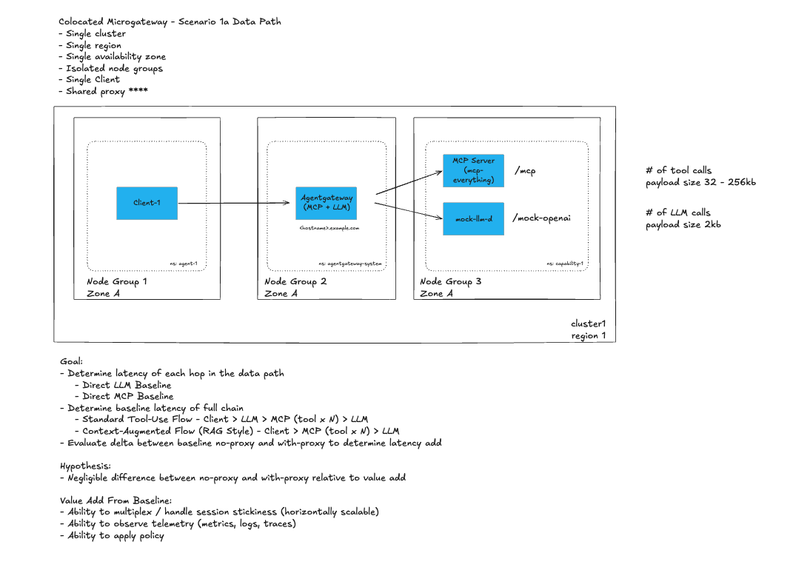

## Components

| Component | Replicas | Notes |
|-----------|----------|-------|
| `agent` | 1 | Locust load test client |
| `agentgateway` | 2 | Handles both `/mcp` and `/mock-openai` routes |
| `mcp-server-everything` | 3 | Reference MCP server |
| `mock-llm-d` | 1 | Mock OpenAI-compatible LLM inference service (llm-d-inference-sim) |
| `prometheus` | 1 | Metrics |
| `grafana` | 1 | Dashboards |

---

## Prerequisites

Complete the following steps before running this scenario:

1. Create the GKE cluster — follow [`gke/main-cluster-gke.md`](../gke/main-cluster-gke.md)
2. [001 - Set Up Enterprise AgentGateway](./installation-steps/001-set-up-enterprise-agentgateway.md)
3. [002 - Set Up Monitoring Tools](./installation-steps/002-set-up-monitoring-tools.md)

Additionally ensure the following are available:
- `kubectl` configured against the target cluster
- `helm`, `jq`, `curl`, Python 3.11+

---

## Quick Start

```bash
chmod +x setup-script.sh
./setup-script.sh
```

The script walks through the following steps interactively:
1. Deploy MCP everything server to `ai-platform` namespace
2. Apply AgentGateway HTTPRoutes and backends
3. Deploy mock-llm (llm-d-inference-sim)
4. Set up Python virtual environment
5. Launch Streamlit single-agent UI (port 8501)

---

## Test Steps

1. Scale the MCP deployment to 3 replicas:

   ```bash
   kubectl scale -n ai-platform deploy/mcp-server-everything --replicas 3
   ```

2. Configure the following in the Streamlit UI:
   - Use default shared gateway
   - **Gateway IP / Host**: `agentgateway-proxy.agentgateway-system.svc.cluster.local`
   - **Gateway Port**: `8000`
   - **MCP Path**: `/mcp`
   - **LLM Path**: `/mock-openai`

3. Run each test with the following parameters:
   - **Concurrent users**: 50 (then 100)
   - **Spawn rate**: 5 users/s
   - **Duration**: 300 seconds (5 mins)

4. Execute each test scenario in order:
   1. **Direct LLM Baseline** (1x LLM call) — LLM Payload size: 256 B
   2. **Direct MCP Baseline** (1x MCP tool call) — MCP Payload Size: 32 KB
   3. **Full Chain - Standard Tool Use Flow** — 1x LLM call + 2x MCP Tool Calls + 1x LLM call — MCP Payload Size: 32 KB
   4. **Full Chain - Context-Augmented Flow (RAG style)** — 2x MCP tool calls + 1x LLM call — MCP Payload Size: 32 KB

5. After each test, rollout restart the backend servers:

   ```bash
   kubectl rollout restart -n ai-platform deployment mcp-server-everything
   kubectl rollout restart -n ai-platform deployment mock-llm
   ```

6. Collect results from:
   - Streamlit / Locust summary tables
   - Grafana Dashboards
   - Prometheus metrics

---

## Results

### 50 VU Results

- **Spawn rate**: 5 users/s
- **Duration**: 300 seconds (5 mins)
- **LLM Payload size**: 256 B
- **MCP Payload Size**: 32 KB

#### AGW > LLM Baseline (1x LLM call)


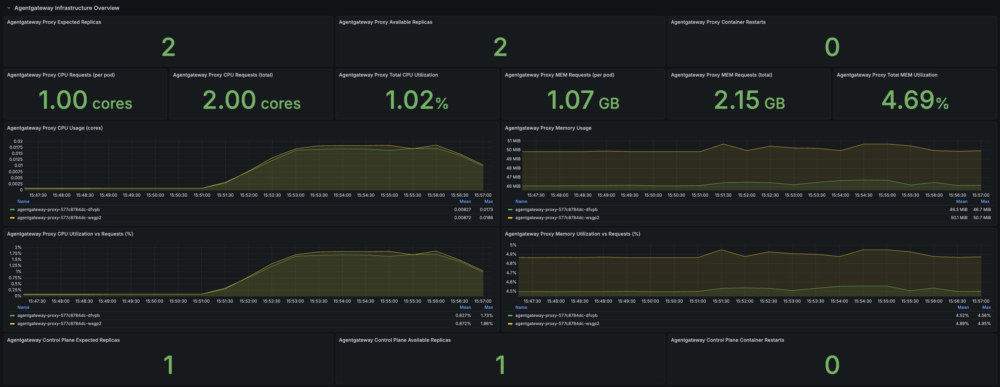
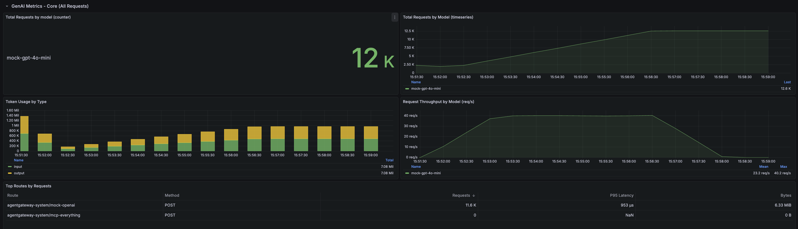

| Endpoint | Reqs | Fails | p50 | p95 | p99 |
|----------|------|-------|-----|-----|-----|
| /mock-openai | 11,906 | 0 | 2ms | 2ms | 3ms |

**Duration:** 4m 59s (2026-03-23 21:51:28 UTC → 2026-03-23 21:56:27 UTC)

**Results compared to baseline** — Negligible 1ms difference between no-proxy and with-proxy

| | p50 | p95 | p99 |
|---|---|---|---|
| Direct Access | 1ms | 2ms | 2ms |
| Agentgateway | 2ms | 2ms | 3ms |

Value Add From Baseline:
- Ability to observe telemetry (metrics, logs, traces)
- Ability to apply policy
- Single point of access for LLM consumption

#### AGW > MCP Baseline (1x MCP tool call)


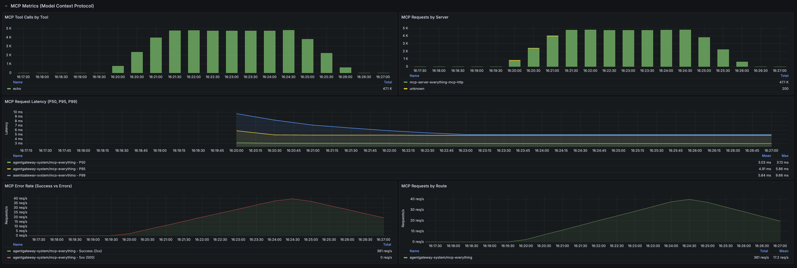

| Endpoint | Reqs | Fails | p50 | p95 | p99 |
|----------|------|-------|-----|-----|-----|
| /mcp initialize | 50 | 0 | 14ms | 24ms | 61ms |
| /mcp → echo tool | 11,783 | 0 | 4ms | 5ms | 6ms |

**Duration:** 4m 59s (2026-03-23 23:19:13 UTC → 2026-03-23 23:24:13 UTC)

**Results compared to baseline** — Negligible difference between no-proxy and with-proxy

| | p50 | p95 | p99 |
|---|---|---|---|
| Direct Access | 3ms | 4ms | 7ms |
| Agentgateway | 4ms | 5ms | 6ms |

#### Full Chain - Standard Tool Use Flow


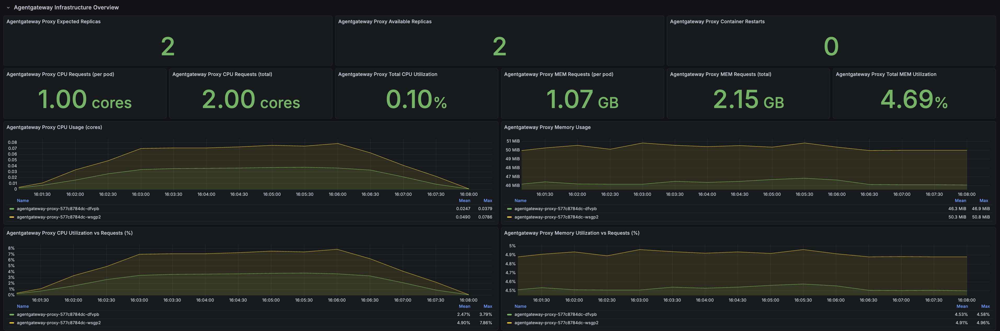
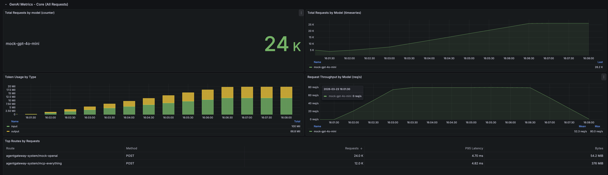
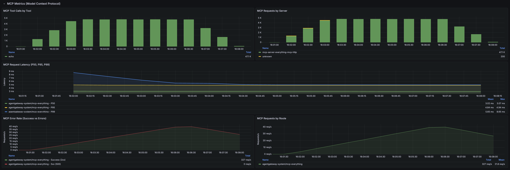

| Endpoint | Reqs | Fails | p50 | p95 | p99 |
|----------|------|-------|-----|-----|-----|
| /mcp initialize | 50 | 0 | 16ms | 61ms | 90ms |
| /mock-openai → initial prompt | 11,744 | 0 | 2ms | 3ms | 4ms |
| /mcp → echo tool | 11,744 | 0 | 4ms | 5ms | 6ms |
| /mock-openai → tool result summary | 11,744 | 0 | 2ms | 3ms | 4ms |
| [full chain] standard tool-use | 11,744 | 0 | 8ms | 10ms | 12ms |

**Duration:** 4m 59s (2026-03-23 22:26:15 UTC → 2026-03-23 22:31:15 UTC)

**Results compared to baseline** — Negligible difference between no-proxy and with-proxy

| | p50 | p95 | p99 |
|---|---|---|---|
| Direct Access | 6ms | 8ms | 11ms |
| Agentgateway | 8ms | 10ms | 12ms |

#### Full Chain - Context-Augmented Flow

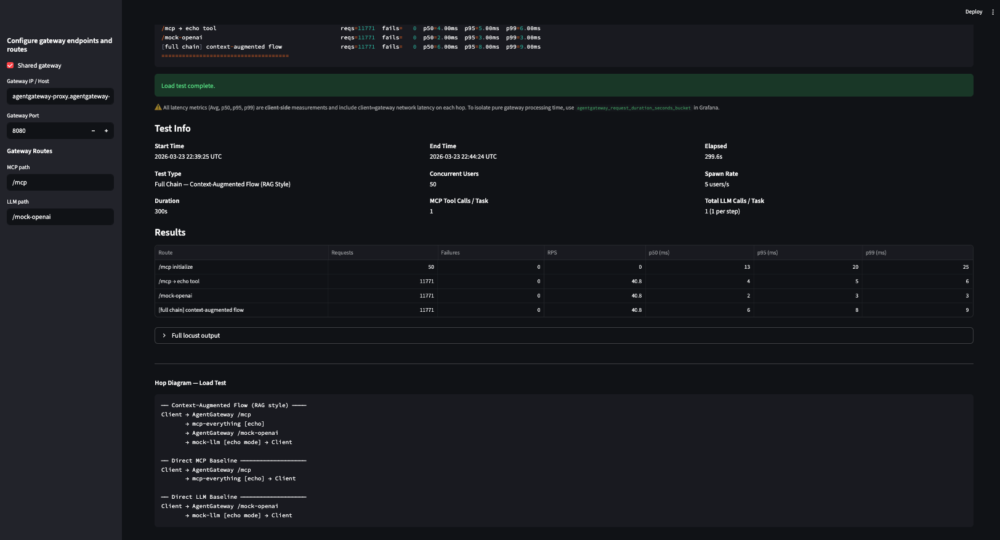
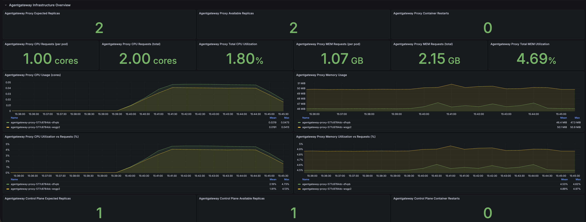


| Endpoint | Reqs | Fails | p50 | p95 | p99 |
|----------|------|-------|-----|-----|-----|
| /mcp initialize | 50 | 0 | 13ms | 20ms | 25ms |
| /mcp → echo tool | 11,771 | 0 | 4ms | 5ms | 6ms |
| /mock-openai | 11,771 | 0 | 2ms | 3ms | 3ms |
| [full chain] context-augmented flow | 11,771 | 0 | 6ms | 8ms | 9ms |

**Duration:** 4m 59s (2026-03-23 22:39:25 UTC → 2026-03-23 22:44:24 UTC)

**Results compared to baseline** — Negligible difference between no-proxy and with-proxy

| | p50 | p95 | p99 |
|---|---|---|---|
| Direct Access | 4ms | 6ms | 8ms |
| Agentgateway | 6ms | 8ms | 9ms |

---

### 100 VU Results

- **Spawn rate**: 5 users/s
- **Duration**: 300 seconds (5 mins)
- **LLM Payload size**: 256 B
- **MCP Payload Size**: 32 KB

#### AGW > LLM Baseline (1x LLM call)

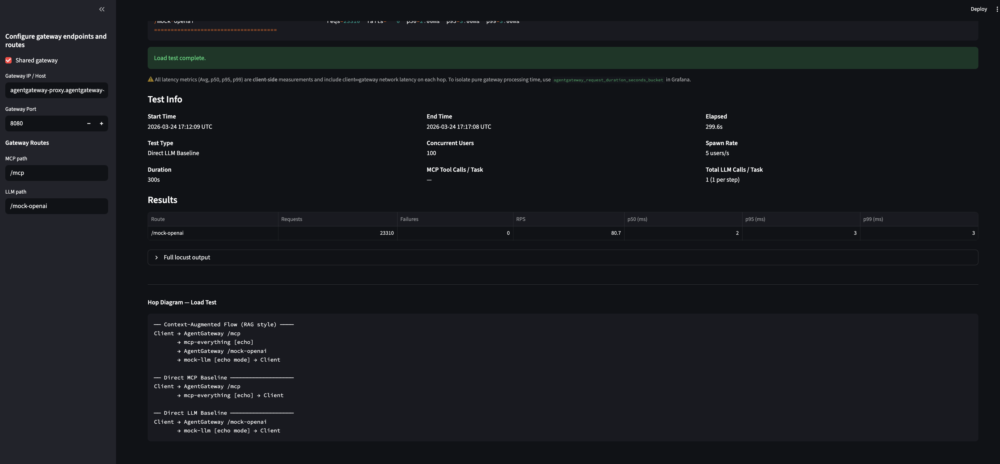
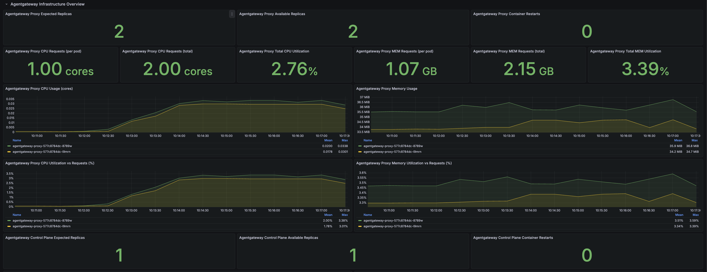
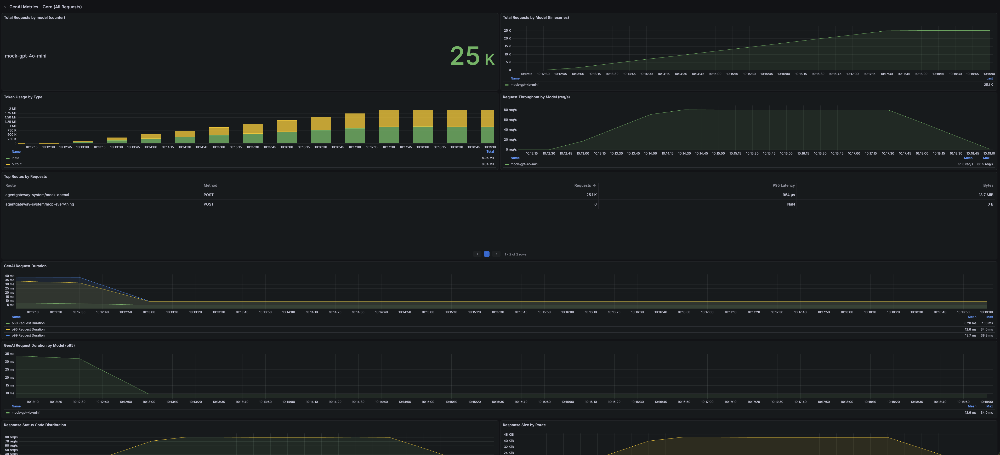

| Endpoint | Reqs | Fails | p50 | p95 | p99 |
|----------|------|-------|-----|-----|-----|
| /mock-openai | 23,310 | 0 | 2ms | 3ms | 3ms |

**Duration:** 4m 59s (2026-03-24 17:12:09 UTC → 2026-03-24 17:17:08 UTC)

**Results compared to 50VU** — Negligible latency difference between 50VU and 100VU. Increased resource usage relative to scale of VUs (predictable).

| | p50 | p95 | p99 | CPU peak |
|---|---|---|---|---|
| 50VU | 2ms | 2ms | 3ms | 0.02 vCPU |
| 100VU | 2ms | 3ms | 3ms | 0.035 vCPU |

#### AGW > MCP Baseline (1x MCP tool call)

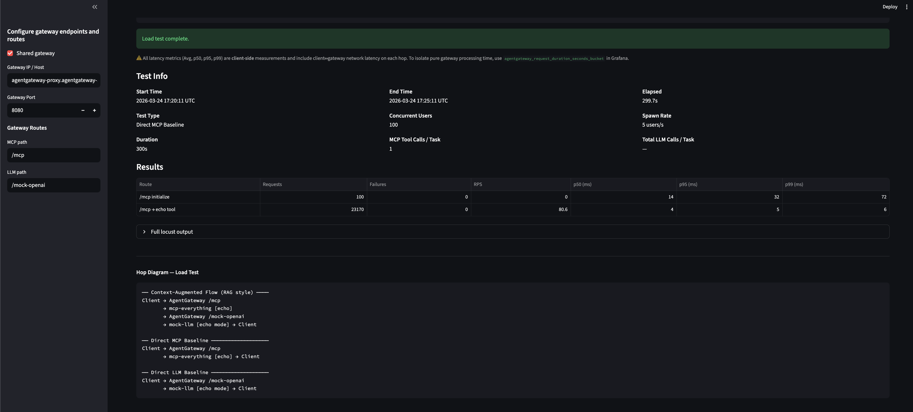
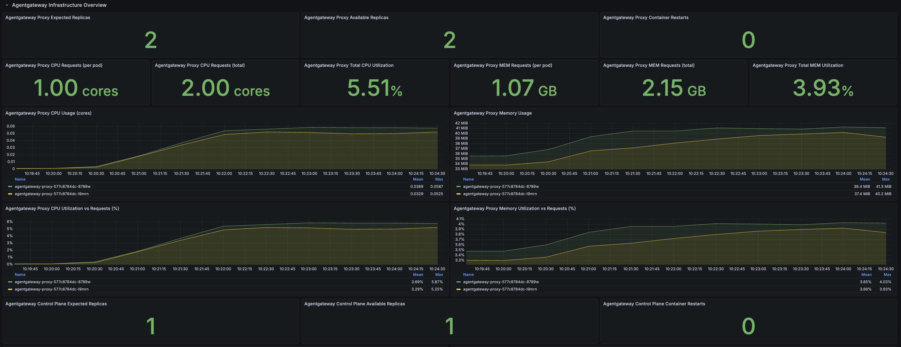
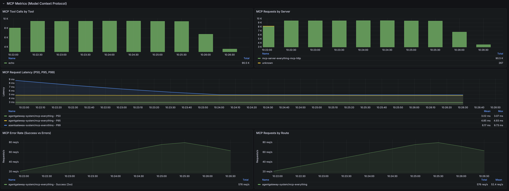

| Endpoint | Reqs | Fails | p50 | p95 | p99 |
|----------|------|-------|-----|-----|-----|
| /mcp initialize | 100 | 0 | 14ms | 32ms | 72ms |
| /mcp → echo tool | 23,170 | 0 | 4ms | 5ms | 6ms |

**Duration:** 4m 59s (2026-03-24 17:20:11 UTC → 2026-03-24 17:25:11 UTC)

**Results compared to 50VU** — Negligible latency difference between 50VU and 100VU. Increased resource usage relative to scale of VUs (predictable).

| | p50 | p95 | p99 | CPU peak |
|---|---|---|---|---|
| 50VU | 4ms | 5ms | 6ms | 0.035 vCPU |
| 100VU | 4ms | 5ms | 6ms | 0.06 vCPU |

#### Full Chain - Standard Tool Use Flow

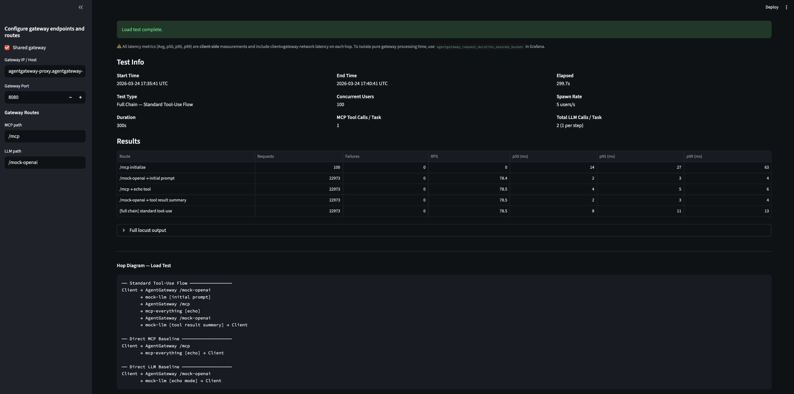
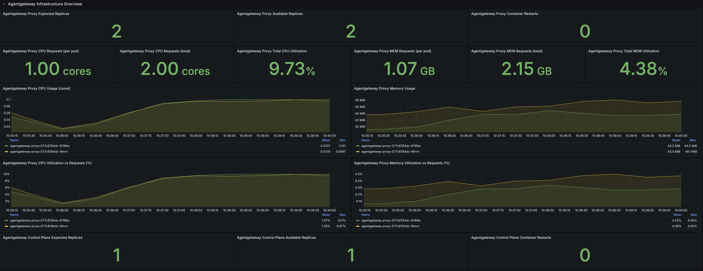
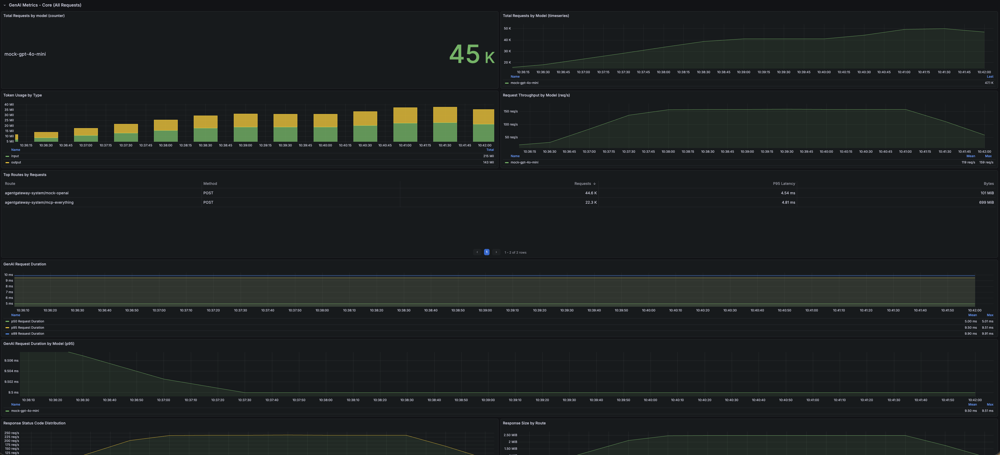
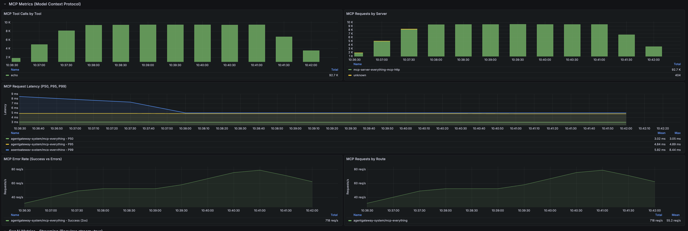

| Endpoint | Reqs | Fails | p50 | p95 | p99 |
|----------|------|-------|-----|-----|-----|
| /mcp initialize | 100 | 0 | 14ms | 27ms | 63ms |
| /mock-openai → initial prompt | 22,973 | 0 | 2ms | 3ms | 4ms |
| /mcp → echo tool | 22,973 | 0 | 4ms | 5ms | 6ms |
| /mock-openai → tool result summary | 22,973 | 0 | 2ms | 3ms | 4ms |
| [full chain] standard tool-use | 22,973 | 0 | 8ms | 11ms | 13ms |

**Duration:** 4m 59s (2026-03-24 17:35:41 UTC → 2026-03-24 17:40:41 UTC)

**Results compared to 50VU** — Negligible latency difference between 50VU and 100VU. Increased resource usage relative to scale of VUs (predictable).

| | p50 | p95 | p99 | CPU peak |
|---|---|---|---|---|
| 50VU | 8ms | 10ms | 12ms | 0.035 vCPU |
| 100VU | 8ms | 11ms | 13ms | 0.1 vCPU |

#### Full Chain - Context-Augmented Flow

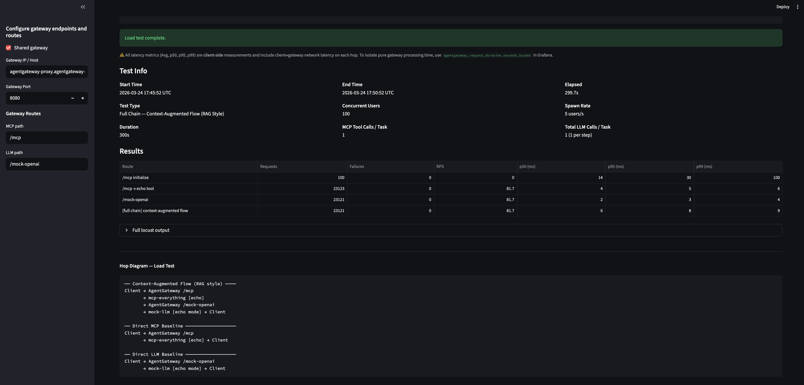
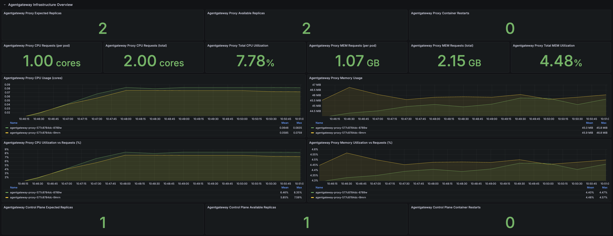
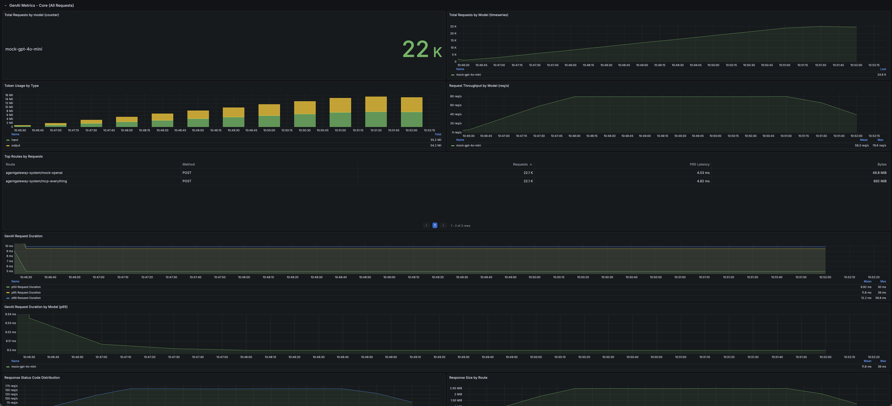
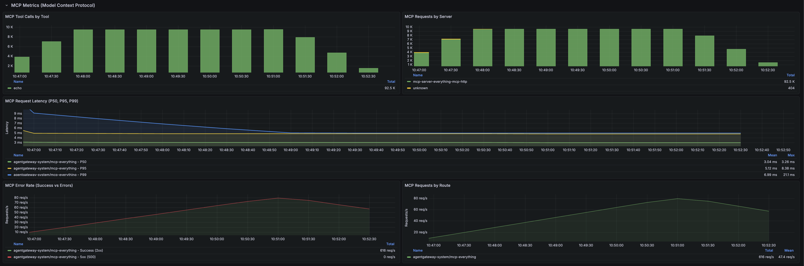

| Endpoint | Reqs | Fails | p50 | p95 | p99 |
|----------|------|-------|-----|-----|-----|
| /mcp initialize | 100 | 0 | 14ms | 30ms | 100ms |
| /mcp → echo tool | 23,123 | 0 | 4ms | 5ms | 6ms |
| /mock-openai | 23,121 | 0 | 2ms | 3ms | 4ms |
| [full chain] context-augmented flow | 23,121 | 0 | 6ms | 8ms | 9ms |

**Duration:** 4m 59s (2026-03-24 17:45:52 UTC → 2026-03-24 17:50:52 UTC)

**Results compared to 50VU** — Negligible latency difference between 50VU and 100VU. Increased resource usage relative to scale of VUs (predictable).

| | p50 | p95 | p99 | CPU peak |
|---|---|---|---|---|
| 50VU | 6ms | 8ms | 9ms | 0.035 vCPU |
| 100VU | 6ms | 8ms | 9ms | 0.09 vCPU |

---

## Observability

```bash
# AgentGateway request logs (hop timing)
kubectl logs -n agentgateway-system deploy/agentgateway -f

# MCP server logs
kubectl logs -n ai-platform deploy/mcp-server-everything -f

# Prometheus metrics
kubectl port-forward -n monitoring svc/prometheus 9090:9090
open http://localhost:9090

# Grafana (if deployed)
kubectl port-forward -n monitoring svc/grafana 3000:3000
open http://localhost:3000
```

Key Prometheus queries:
```promql
# P99 latency per route
histogram_quantile(0.99, sum(rate(agentgateway_request_duration_seconds_bucket[5m])) by (le, route))

# Requests per second
sum(rate(agentgateway_requests_total[1m])) by (route)

# Error rate
sum(rate(agentgateway_requests_total{status=~"5.."}[1m])) by (route)
```

---

## File Structure

```
scenario-1a/
├── README.md               # This file
├── setup-script.sh          # One-shot setup & teardown
├── agent/
│   ├── app.py              # Streamlit UI (single-agent + load test launcher)
│   ├── loadtest.py         # Locust load test definition
│   └── requirements.txt    # Python dependencies
├── k8s/
│   └── mcp-everything-deployment.yaml  # MCP everything server + service
├── route/
│   ├── mock-openai-httproute.yaml       # /mock-openai route (mock LLM proxy)
│   ├── mock-openai-backend.yaml        # mock-llm AgentgatewayBackend
│   ├── mcp-everything-httproute.yaml   # /mcp route (MCP proxy)
│   └── mcp-everything-backend.yaml     # MCP everything AgentgatewayBackend
└── images/                             # Locust & Grafana screenshots for test results
    ├── 50vu/
    └── 100vu/
```

---

### 250 VU Results

- **Spawn rate**: 5 users/s
- **Duration**: 300 seconds (5 mins)
- **LLM Payload size**: 256 B
- **MCP Payload Size**: 32 KB

#### AGW > LLM Baseline (1x LLM call)

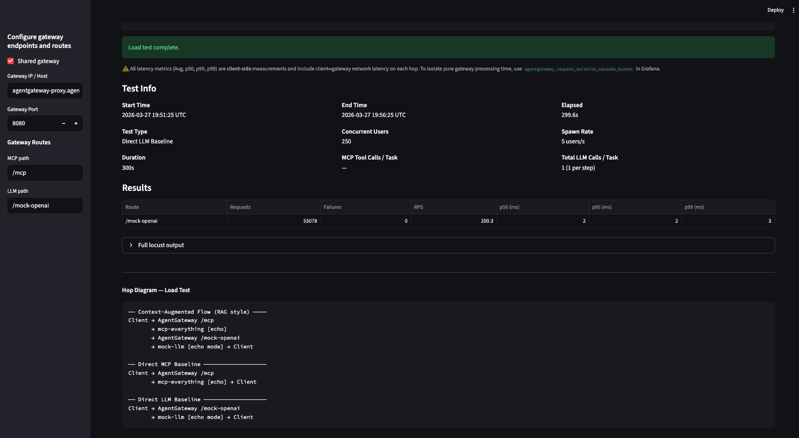
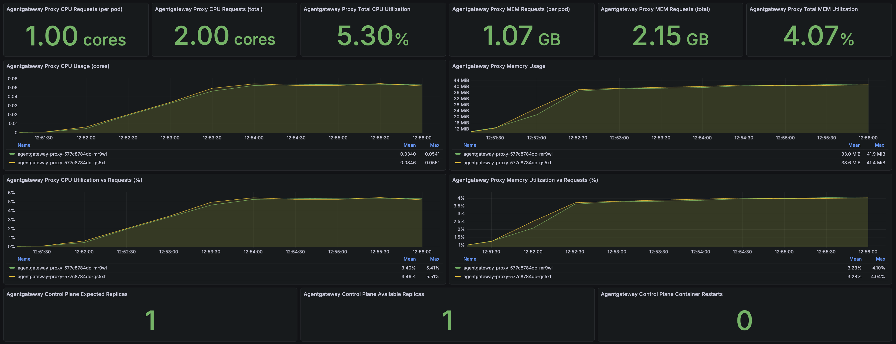
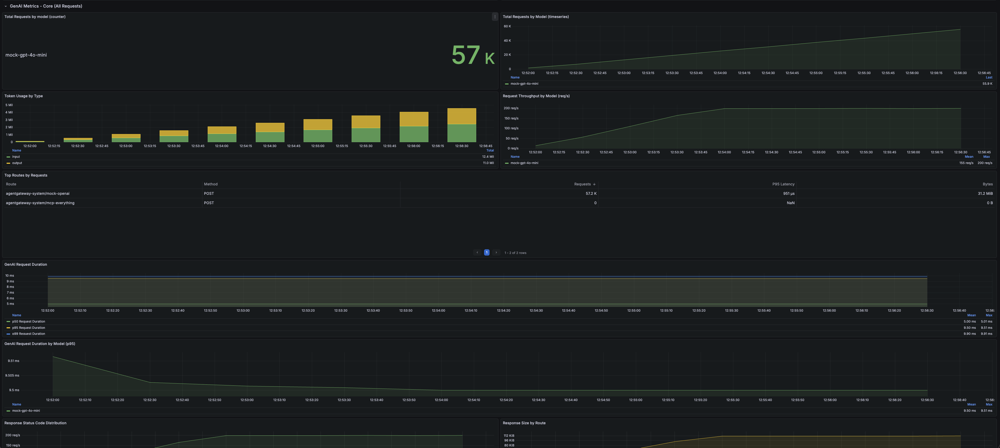

| Endpoint | Reqs | Fails | p50 | p95 | p99 |
|----------|------|-------|-----|-----|-----|
| /mock-openai | 55078 | 0 | 2ms | 2ms | 3ms |

**Duration:** 4m 59s (2026-03-27 19:51:25 UTC → 2026-03-27 19:56:25 UTC)

**Results compared to 50VU** — Negligible latency difference between 50VU and 250vu. Increased resource usage relative to scale of VUs (predictable).

| | p50 | p95 | p99 | CPU peak |
|---|---|---|---|---|
| 50VU | 2ms | 2ms | 3ms | 0.02 vCPU |
| 250vu | 2ms | 2ms | 3ms | 0.06 vCPU |

#### AGW > MCP Baseline (1x MCP tool call)

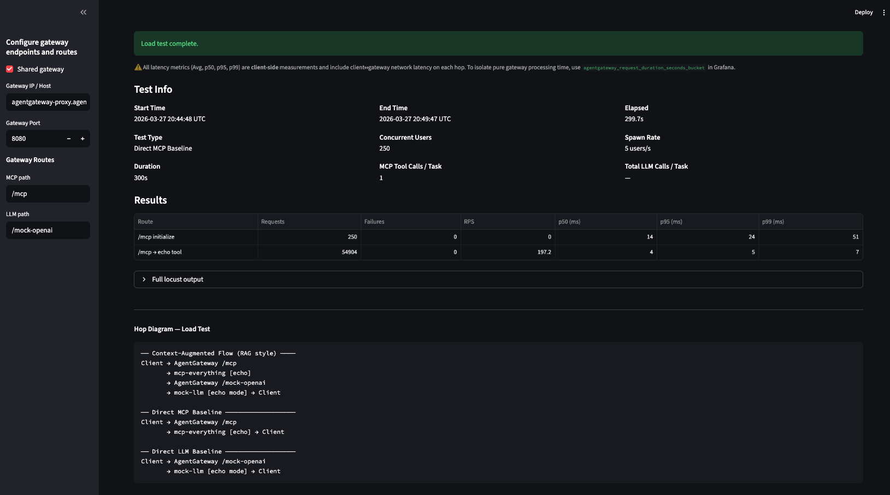
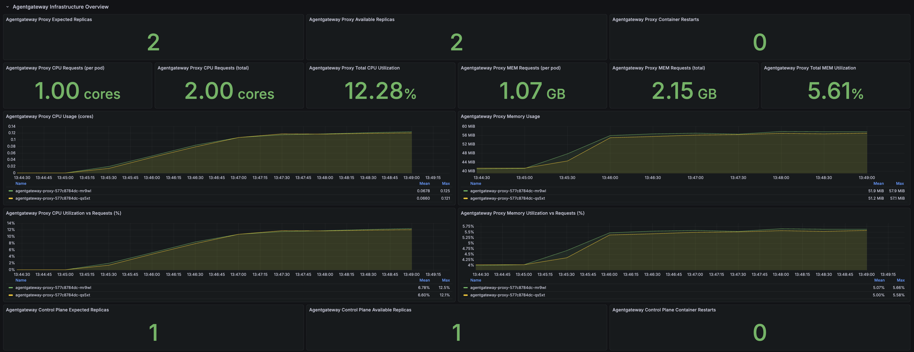
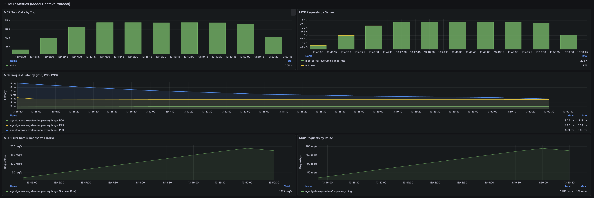

| Endpoint | Reqs | Fails | p50 | p95 | p99 |
|----------|------|-------|-----|-----|-----|
| /mcp initialize | 250 | 0 | 14ms | 24ms | 51ms |
| /mcp → echo tool | 54904 | 0 | 4ms | 5ms | 7ms |

**Duration:** 4m 59s (2026-03-27 20:44:48 UTC → 2026-03-27 20:49:47 UTC)

**Results compared to 50VU** — Negligible latency difference between 50VU and 250vu. Increased resource usage relative to scale of VUs (predictable).

| | p50 | p95 | p99 | CPU peak |
|---|---|---|---|---|
| 50VU | 4ms | 5ms | 6ms | 0.035 vCPU |
| 250vu | 4ms | 5ms | 7ms | 0.125 vCPU |

#### Full Chain - Standard Tool Use Flow

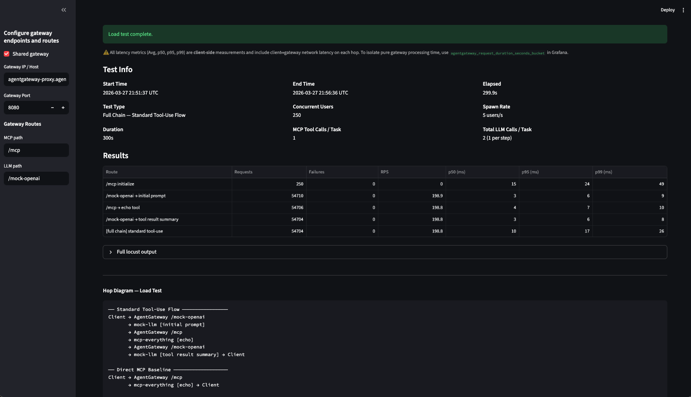
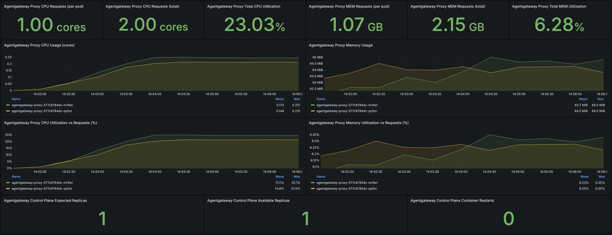
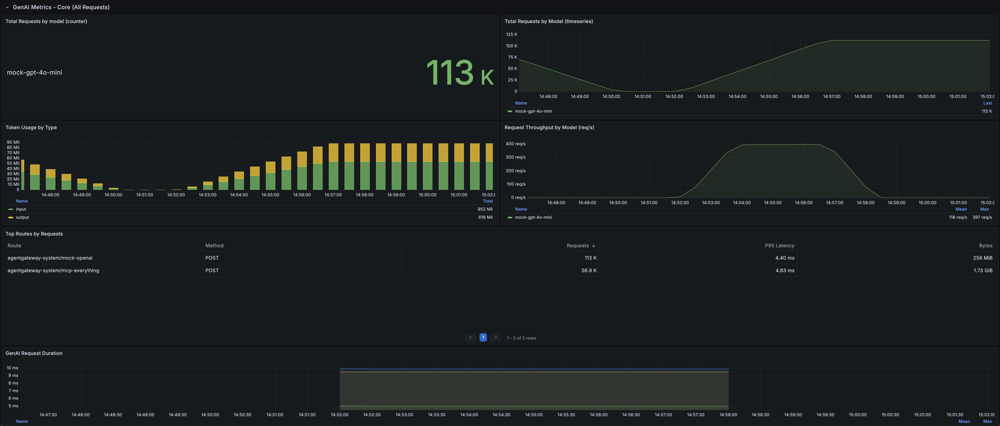
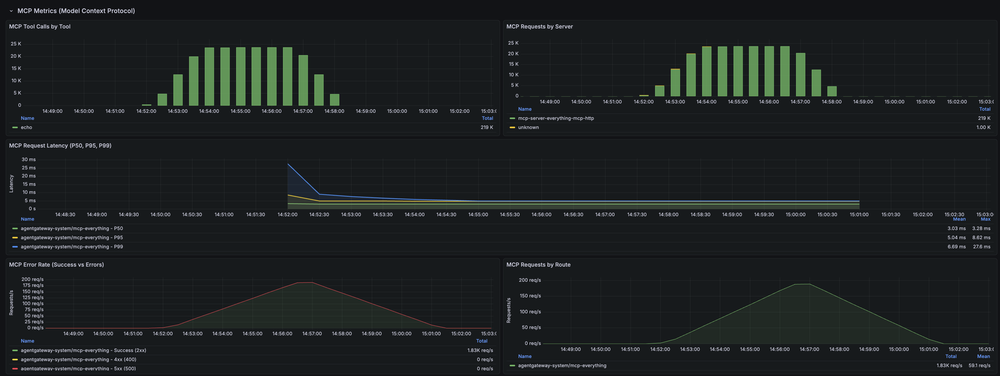


| Endpoint | Reqs | Fails | p50 | p95 | p99 |
|----------|------|-------|-----|-----|-----|
| /mcp initialize | 250 | 0 | 15ms | 24ms | 49ms |
| /mock-openai → initial prompt | 54,710 | 0 | 3ms | 6ms | 9ms |
| /mcp → echo tool | 54706 | 0 | 4ms | 7ms | 10ms |
| /mock-openai → tool result summary | 54704 | 0 | 3s | 6ms | 8ms |
| [full chain] standard tool-use | 54704 | 0 | 10ms | 17ms | 26ms |

**Duration:** 4m 59s (2026-03-27 21:30:30 UTC → 2026-03-27 21:35:30 UTC)

**Results compared to 50VU** — Negligible latency difference between 50VU and 250vu. Increased resource usage relative to scale of VUs (predictable).

| | p50 | p95 | p99 | CPU peak |
|---|---|---|---|---|
| 50VU | 8ms | 10ms | 12ms | 0.035 vCPU |
| 250VU | 10ms | 17ms | 26ms | 0.245 vCPU |

#### Full Chain - Context-Augmented Flow

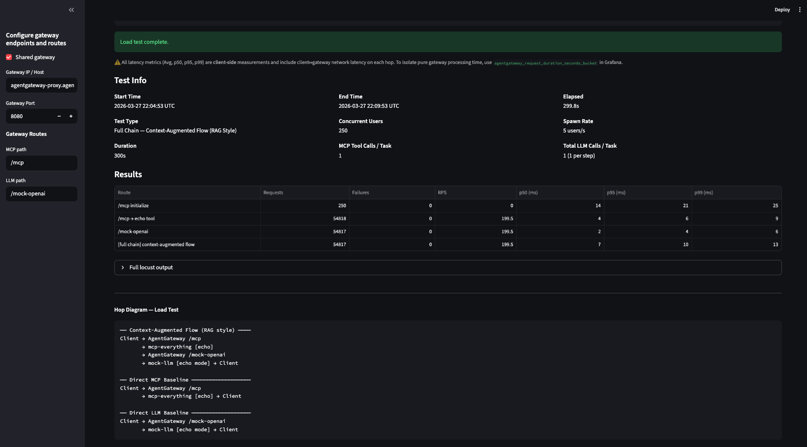
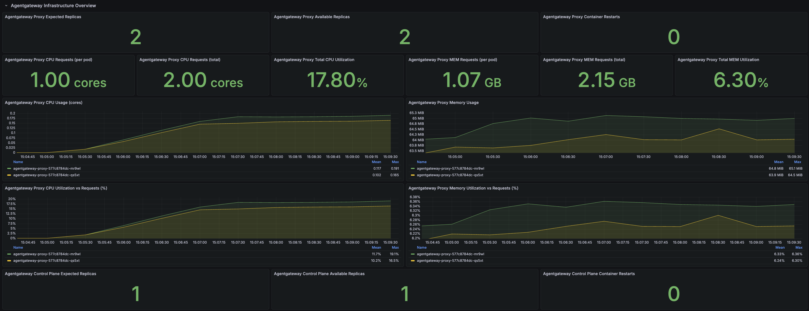
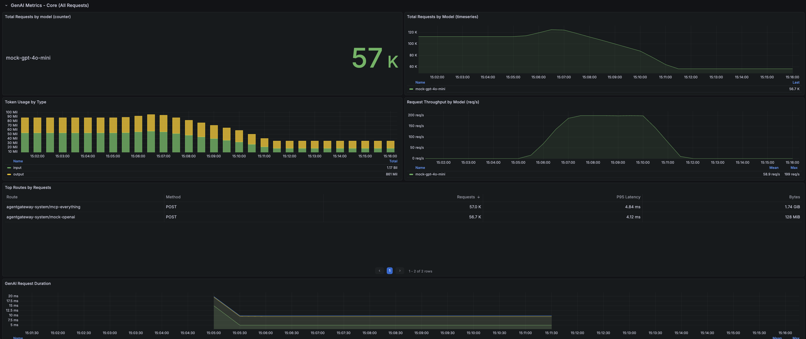
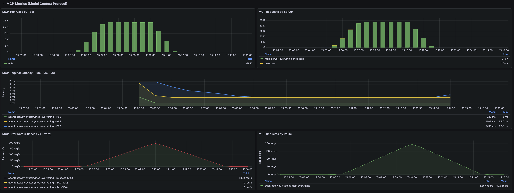

| Endpoint | Reqs | Fails | p50 | p95 | p99 |
|----------|------|-------|-----|-----|-----|
| /mcp initialize | 250 | 0 | 14ms | 21ms | 25ms |
| /mcp → echo tool | 54818 | 0 | 4ms | 6ms | 9ms |
| /mock-openai | 54817 | 0 | 2ms | 4ms | 6ms |
| [full chain] context-augmented flow | 54817 | 0 | 7ms | 10ms | 13ms |

**Duration:** 4m 59s (2026-03-27 22:04:53 UTC → 2026-03-27 22:09:53 UTC)

**Results compared to 50VU** — Negligible latency difference between 50VU and 250vu. Increased resource usage relative to scale of VUs (predictable).

| | p50 | p95 | p99 | CPU peak |
|---|---|---|---|---|
| 50VU | 6ms | 8ms | 9ms | 0.035 vCPU |
| 250vu | 7ms | 10ms | 13ms | 0.19 vCPU |

---

## Observability

```bash
# AgentGateway request logs (hop timing)
kubectl logs -n agentgateway-system deploy/agentgateway -f

# MCP server logs
kubectl logs -n ai-platform deploy/mcp-server-everything -f

# Prometheus metrics
kubectl port-forward -n monitoring svc/prometheus 9090:9090
open http://localhost:9090

# Grafana (if deployed)
kubectl port-forward -n monitoring svc/grafana 3000:3000
open http://localhost:3000
```

Key Prometheus queries:
```promql
# P99 latency per route
histogram_quantile(0.99, sum(rate(agentgateway_request_duration_seconds_bucket[5m])) by (le, route))

# Requests per second
sum(rate(agentgateway_requests_total[1m])) by (route)

# Error rate
sum(rate(agentgateway_requests_total{status=~"5.."}[1m])) by (route)
```

---

## File Structure

```
scenario-1a/
├── README.md               # This file
├── setup-script.sh          # One-shot setup & teardown
├── agent/
│   ├── app.py              # Streamlit UI (single-agent + load test launcher)
│   ├── loadtest.py         # Locust load test definition
│   └── requirements.txt    # Python dependencies
├── k8s/
│   └── mcp-everything-deployment.yaml  # MCP everything server + service
├── route/
│   ├── mock-openai-httproute.yaml       # /mock-openai route (mock LLM proxy)
│   ├── mock-openai-backend.yaml        # mock-llm AgentgatewayBackend
│   ├── mcp-everything-httproute.yaml   # /mcp route (MCP proxy)
│   └── mcp-everything-backend.yaml     # MCP everything AgentgatewayBackend
└── images/                             # Locust & Grafana screenshots for test results
    ├── 50vu/
    └── 250vu/
```
