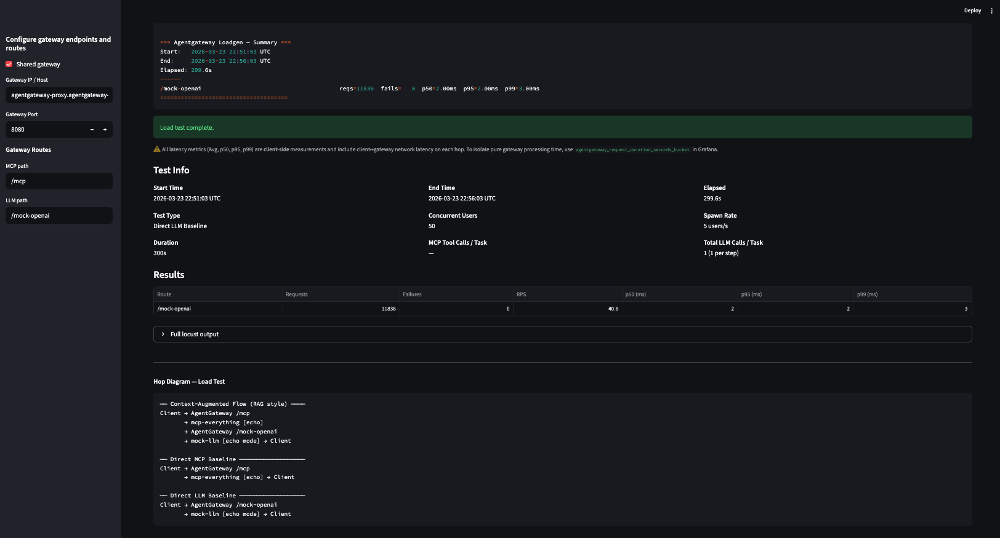
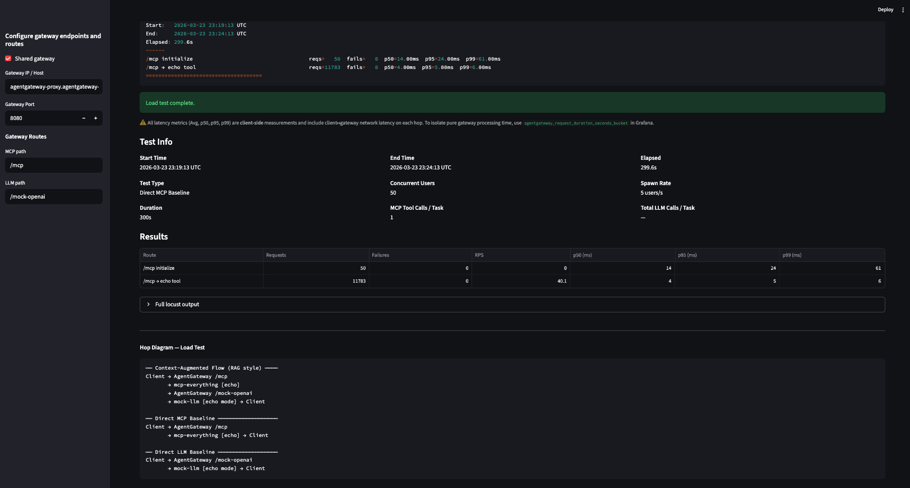
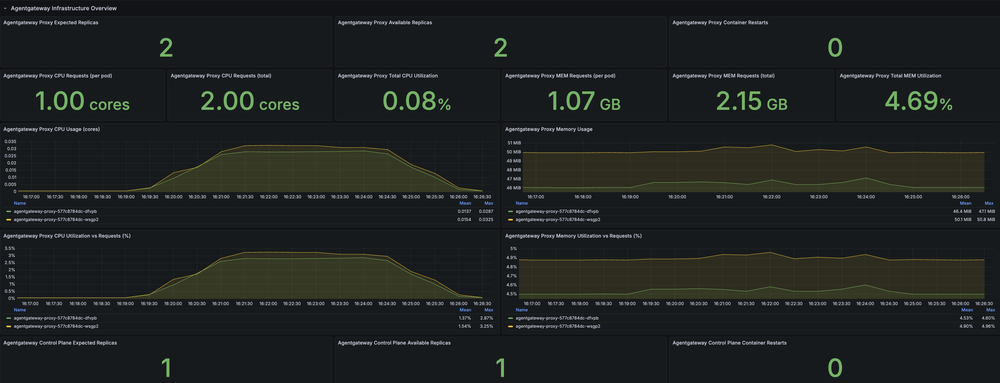
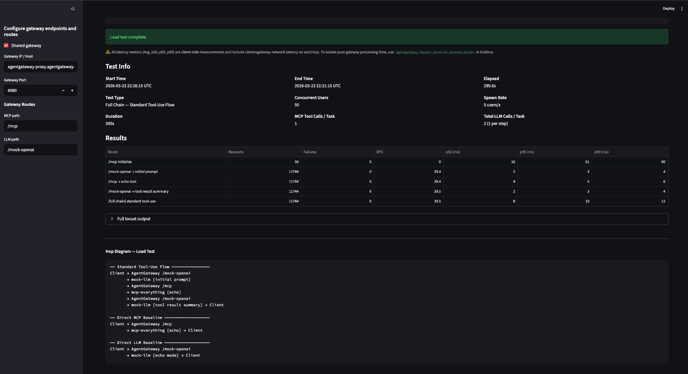
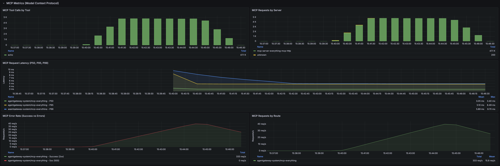
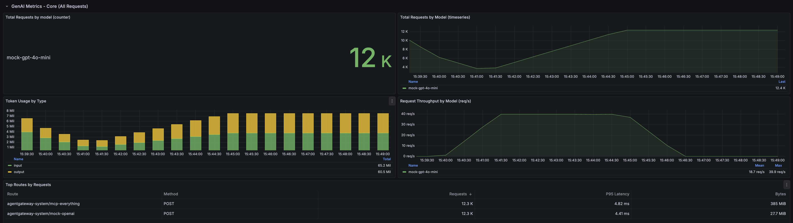

# Scenario 1a Results
Duration 300 seconds (5 mins)
LLM Payload size: 256 B
MCP Payload Size: 32 KB

- AGW > LLM Baseline (1x LLM call)
- AGW > MCP Baseline (1x MCP tool call)
- Full Chain
    - Standard Tool Use Flow
        - 1x LLM call + 2x MCP Tool Calls x 1x LLM call
    - Context-Augmented Flow (RAG style)
        - 2x MCP tool calls x 1x LLM call

# Scenario 1a - Agentgateway to LLM Baseline (5-min)



```
Response time percentiles (approximated)
Type     Name                                                                                  50%    66%    75%    80%    90%    95%    98%    99%  99.9% 99.99%   100% # reqs
--------|--------------------------------------------------------------------------------|--------|------|------|------|------|------|------|------|------|------|------|------
POST     /mock-openai                                                                            2      2      2      2      2      2      3      3     11     33     33  11906
--------|--------------------------------------------------------------------------------|--------|------|------|------|------|------|------|------|------|------|------|------
         Aggregated                                                                              2      2      2      2      2      2      3      3     11     33     33  11906


=== Agentgateway Loadgen — Summary ===
Start:   2026-03-23 21:51:28 UTC
End:     2026-03-23 21:56:27 UTC
Elapsed: 299.6s
------
/mock-openai                                        reqs=11906  fails=   0  p50=2.00ms  p95=2.00ms  p99=3.00ms
=====================================
```

## Results compared to baseline
- Negligible 1ms difference between no-proxy and with-proxy relative to value add

Direct Access: p50=1.00ms  p95=2.00ms  p99=2.00ms
Agentgateway: p50=2.00ms  p95=2.00ms  p99=3.00ms

Value Add From Baseline:
- Ability to observe telemetry (metrics, logs, traces)
- Ability to apply policy
- Single point of access for LLM consumption

# Scenario 1a - Agentgateway to MCP Baseline (5-min)




```
Response time percentiles (approximated)
Type     Name                                                                                  50%    66%    75%    80%    90%    95%    98%    99%  99.9% 99.99%   100% # reqs
--------|--------------------------------------------------------------------------------|--------|------|------|------|------|------|------|------|------|------|------|------
POST     /mcp initialize                                                                        14     15     16     16     19     24     61     61     61     61     61     50
POST     /mcp → echo tool                                                                        4      4      4      4      5      5      6      6     15     43     44  11783
--------|--------------------------------------------------------------------------------|--------|------|------|------|------|------|------|------|------|------|------|------
         Aggregated                                                                              4      4      4      4      5      5      6      7     19     44     61  11833


=== Agentgateway Loadgen — Summary ===
Start:   2026-03-23 23:19:13 UTC
End:     2026-03-23 23:24:13 UTC
Elapsed: 299.6s
------
/mcp initialize                                     reqs=   50  fails=   0  p50=14.00ms  p95=24.00ms  p99=61.00ms
/mcp → echo tool                                    reqs=11783  fails=   0  p50=4.00ms  p95=5.00ms  p99=6.00ms
=====================================
```

## Results compared to baseline
- Negligible difference between no-proxy and with-proxy for MCP access

>Direct Access: p50=3.00ms  p95=4.00ms  p99=7.00ms

>Agentgateway: p50=4.00ms  p95=5.00ms  p99=6.00ms

# Full Chain - Standard Tool Use Flow (5 mins)



```
Response time percentiles (approximated)
Type     Name                                                                                  50%    66%    75%    80%    90%    95%    98%    99%  99.9% 99.99%   100% # reqs
--------|--------------------------------------------------------------------------------|--------|------|------|------|------|------|------|------|------|------|------|------
POST     /mcp initialize                                                                        16     17     19     21     55     61     90     90     90     90     90     50
POST     /mcp → echo tool                                                                        4      4      4      4      4      5      5      6      9     15     17  11744
POST     /mock-openai → initial prompt                                                           2      2      2      3      3      3      3      4      5     13     14  11744
POST     /mock-openai → tool result summary                                                      2      2      2      3      3      3      3      4      5     14     17  11744
CHAIN    [full chain] standard tool-use                                                          8      9      9      9     10     10     11     12     18     23     24  11744
--------|--------------------------------------------------------------------------------|--------|------|------|------|------|------|------|------|------|------|------|------
         Aggregated                                                                              3      4      7      8      9      9     10     11     15     55     90  47026


=== Agentgateway Loadgen — Summary ===
Start:   2026-03-23 22:26:15 UTC
End:     2026-03-23 22:31:15 UTC
Elapsed: 299.6s
------
/mcp initialize                                     reqs=   50  fails=   0  p50=16.00ms  p95=61.00ms  p99=90.00ms
/mock-openai → initial prompt                       reqs=11744  fails=   0  p50=2.00ms  p95=3.00ms  p99=4.00ms
/mcp → echo tool                                    reqs=11744  fails=   0  p50=4.00ms  p95=5.00ms  p99=6.00ms
/mock-openai → tool result summary                  reqs=11744  fails=   0  p50=2.00ms  p95=3.00ms  p99=4.00ms
[full chain] standard tool-use                      reqs=11744  fails=   0  p50=8.00ms  p95=10.00ms  p99=12.00ms
=====================================
```

## Results compared to baseline
- Negligible difference between no-proxy and with-proxy for full chain standard tool use flow

>Direct Access: p50=6.00ms  p95=8.00ms  p99=11.00ms

>Agentgateway: p50=8.00ms  p95=10.00ms  p99=12.00ms

# Full Chain - Context-Augmented Flow (5 mins)





```
Response time percentiles (approximated)
Type     Name                                                                                  50%    66%    75%    80%    90%    95%    98%    99%  99.9% 99.99%   100% # reqs
--------|--------------------------------------------------------------------------------|--------|------|------|------|------|------|------|------|------|------|------|------
POST     /mcp initialize                                                                        13     14     16     17     18     20     25     25     25     25     25     50
POST     /mcp → echo tool                                                                        4      4      4      4      5      5      6      6      9     16     17  11771
POST     /mock-openai                                                                            2      2      2      2      2      3      3      3     14     25     26  11771
CHAIN    [full chain] context-augmented flow                                                     6      6      7      7      7      8      8      9     19     30     30  11771
--------|--------------------------------------------------------------------------------|--------|------|------|------|------|------|------|------|------|------|------|------
         Aggregated                                                                              4      5      6      6      7      7      8      8     16     27     30  35363


=== Agentgateway Loadgen — Summary ===
Start:   2026-03-23 22:39:25 UTC
End:     2026-03-23 22:44:24 UTC
Elapsed: 299.6s
------
/mcp initialize                                     reqs=   50  fails=   0  p50=13.00ms  p95=20.00ms  p99=25.00ms
/mcp → echo tool                                    reqs=11771  fails=   0  p50=4.00ms  p95=5.00ms  p99=6.00ms
/mock-openai                                        reqs=11771  fails=   0  p50=2.00ms  p95=3.00ms  p99=3.00ms
[full chain] context-augmented flow                 reqs=11771  fails=   0  p50=6.00ms  p95=8.00ms  p99=9.00ms
=====================================
```

## Results compared to baseline
- Negligible difference between no-proxy and with-proxy for full chain context augmented flow

>Direct Access: p50=4.00ms  p95=6.00ms  p99=8.00ms

>Agentgateway: p50=6.00ms  p95=8.00ms  p99=9.00ms
