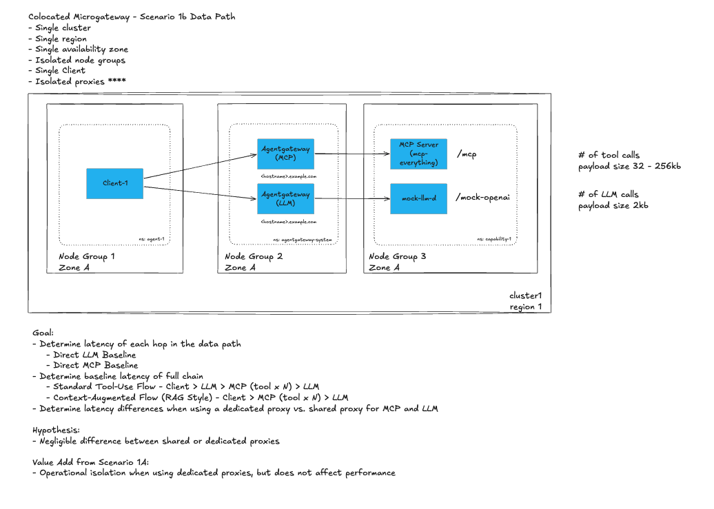
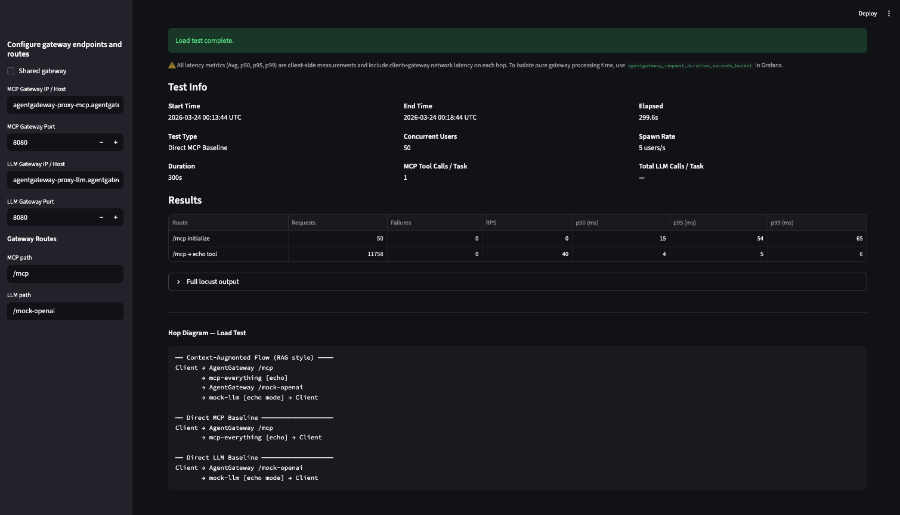
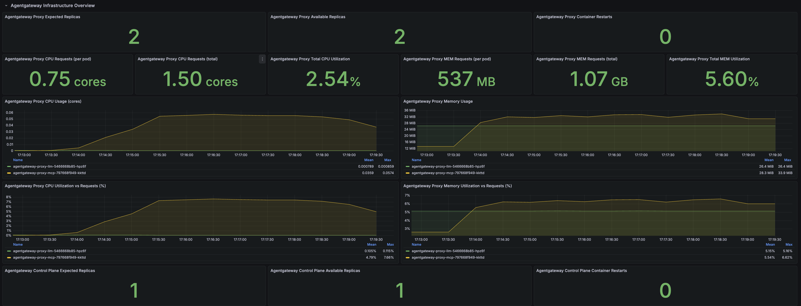
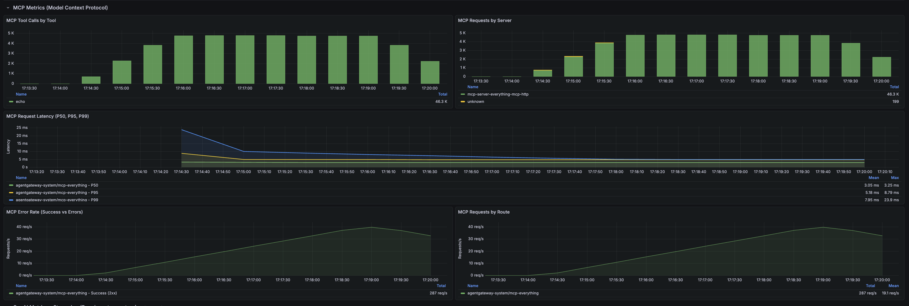
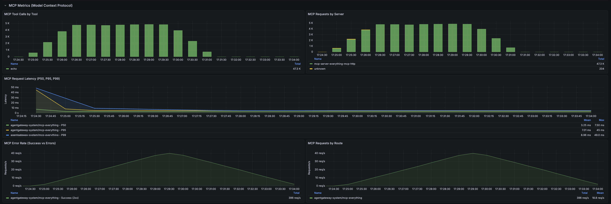

# Scenario 1b: Colocated Microgateway — Isolated Proxies

> **Goal**: Determine latency of each hop in the data path (Direct LLM Baseline, Direct MCP Baseline), determine baseline latency of full chain (Standard Tool-Use Flow and Context-Augmented/RAG Flow), and determine latency differences when using a dedicated proxy vs. shared proxy for MCP and LLM.
>
> **Hypothesis**: Negligible difference between shared or dedicated proxies.
>
> **Value Add from Scenario 1a**: Operational isolation when using dedicated proxies, but does not affect performance.
>
> **Data path hops tested**:
> - Direct LLM Baseline
> - Direct MCP Baseline
> - Standard Tool-Use Flow: Client > LLM > MCP (tool x N) > LLM
> - Context-Augmented Flow (RAG Style): Client > MCP (tool x N) > LLM

## Architecture

> Single cluster · Single region · Single AZ · Isolated node groups · Single client · Isolated proxies




## Difference from Scenario 1a

| | Scenario 1a | Scenario 1b |
|-|-------------|-------------|
| Gateway resources | 1 (`agentgateway-proxy`) | 2 (`agentgateway-proxy-mcp`, `agentgateway-proxy-llm`) |
| Proxy deployments | 1 shared | 2 dedicated |
| Gateway services | 1 LoadBalancer | 2 LoadBalancers |
| HTTPRoutes | 2 routes on same gateway | 1 route per gateway |
| Dashboard | Shared | Shared (unchanged) |

---

## Components

| Component | Replicas | Notes |
|-----------|----------|-------|
| `agent` | 1 | Locust load test client |
| `agentgateway-proxy-mcp` | 1 | Handles `/mcp` routes only |
| `agentgateway-proxy-llm` | 1 | Handles `/mock-openai` routes only |
| `mcp-server-everything` | 3 | Reference MCP server |
| `mock-llm-d` | 1 | Mock OpenAI-compatible LLM inference service (llm-d-inference-sim) |
| `prometheus` | 1 | Metrics |
| `grafana` | 1 | Dashboards |

---

## Prerequisites

Complete the following steps before running this scenario:

1. Create the GKE cluster — follow [`gke/main-cluster-gke.md`](../gke/main-cluster-gke.md)
2. [001 - Set Up Enterprise AgentGateway](../scenario-1a/installation-steps/001-set-up-enterprise-agentgateway.md)
3. [002 - Set Up Monitoring Tools](../scenario-1a/installation-steps/002-set-up-monitoring-tools.md)

> **Coming from Scenario 1a?** The [`installation-steps/`](./installation-steps/) directory contains scripts and instructions to convert an existing 1a deployment to 1b.

Additionally ensure the following are available:
- `kubectl` configured against the target cluster
- `helm`, `jq`, `curl`, Python 3.11+

---

## Quick Start

```bash
chmod +x setup-script.sh
./setup-script.sh
```

The script walks through the following steps interactively:
1. Deploy MCP everything server to `ai-platform` namespace
2. Apply AgentGateway HTTPRoutes and backends
3. Deploy mock-llm (llm-d-inference-sim)
4. Set up Python virtual environment
5. Launch Streamlit single-agent UI (port 8501)

---

## Test Steps

### 1. Scale MCP deployment

```bash
kubectl scale -n ai-platform deploy/mcp-server-everything --replicas 3
```

### 2. Configure the Streamlit UI

**MCP Baseline / Full Chain tests:**

| Setting | Value |
|---------|-------|
| Gateway IP / Host | `agentgateway-proxy-mcp.agentgateway-system.svc.cluster.local` |
| Gateway Port | `8080` |
| MCP Path | `/mcp` |
| LLM Path | `/mock-openai` |

**Direct LLM Baseline tests:**

| Setting | Value |
|---------|-------|
| Gateway IP / Host | `agentgateway-proxy-llm.agentgateway-system.svc.cluster.local` |
| Gateway Port | `8080` |
| LLM Path | `/mock-openai` |

### 3. Run tests

**Load profile:**
- 50 concurrent users
- Spawn rate: 5 users/s
- Duration: 300 seconds (5 mins)

**Test matrix:**

1. **Direct LLM Baseline** (1x LLM call)
   - LLM Payload size: 256 B
2. **Direct MCP Baseline** (1x MCP tool call)
   - MCP Payload Size: 32 KB
3. **Full Chain — Standard Tool Use Flow**
   - 1x LLM call + 2x MCP Tool Calls + 1x LLM call
   - MCP Payload Size: 32 KB
4. **Full Chain — Context-Augmented Flow (RAG style)**
   - 2x MCP tool calls + 1x LLM call
   - MCP Payload Size: 32 KB

### 4. After each test

Rollout restart the backend servers:

```bash
kubectl rollout restart -n ai-platform deployment mcp-server-everything
kubectl rollout restart -n ai-platform deployment mock-llm
```

### 5. Collect results

- Output from Streamlit / Locust summary tables
- Grafana Dashboards (same dashboard as Scenario 1a — no changes required)
- Prometheus metrics

---

## Results

**Test parameters:** 50 VU | Spawn rate 5 users/s | Duration 300 s (5 min) | LLM Payload 256 B | MCP Payload 32 KB

### Agentgateway to LLM Baseline (5-min)


| Endpoint | Reqs | Fails | p50 | p95 | p99 |
|----------|------|-------|-----|-----|-----|
| /mock-openai | 11,813 | 0 | 2ms | 2ms | 3ms |

**Duration:** 4m 59s (2026-03-24 00:03:24 UTC → 2026-03-24 00:08:24 UTC)

**Compared to Scenario 1a** — Negligible difference between shared-proxy and dedicated

| | p50 | p95 | p99 |
|---|---|---|---|
| Shared gateway | 2ms | 2ms | 3ms |
| Dedicated Gateways | 2ms | 2ms | 3ms |

---

### Agentgateway to MCP Baseline (5-min)





| Endpoint | Reqs | Fails | p50 | p95 | p99 |
|----------|------|-------|-----|-----|-----|
| /mcp initialize | 50 | 0 | 15ms | 54ms | 65ms |
| /mcp → echo tool | 11,758 | 0 | 4ms | 5ms | 6ms |

**Duration:** 4m 59s (2026-03-24 00:13:44 UTC → 2026-03-24 00:18:44 UTC)

**Compared to Scenario 1a** — Negligible difference between shared-proxy and dedicated

| | p50 | p95 | p99 |
|---|---|---|---|
| Shared gateway | 4ms | 5ms | 6ms |
| Dedicated Gateways | 4ms | 5ms | 6ms |

---

### Full Chain - Standard Tool Use Flow (5-min)




| Endpoint | Reqs | Fails | p50 | p95 | p99 |
|----------|------|-------|-----|-----|-----|
| /mcp initialize | 50 | 0 | 15ms | 50ms | 57ms |
| /mock-openai → initial prompt | 11,811 | 0 | 2ms | 3ms | 4ms |
| /mcp → echo tool | 11,811 | 0 | 4ms | 5ms | 6ms |
| /mock-openai → tool result summary | 11,811 | 0 | 2ms | 3ms | 4ms |
| [full chain] standard tool-use | 11,811 | 0 | 8ms | 10ms | 12ms |

**Duration:** 4m 59s (2026-03-24 00:24:17 UTC → 2026-03-24 00:29:16 UTC)

**Compared to Scenario 1a** — Negligible difference between shared-proxy and dedicated

| | p50 | p95 | p99 |
|---|---|---|---|
| Shared gateway | 8ms | 10ms | 12ms |
| Dedicated Gateways | 8ms | 10ms | 12ms |

---

### Full Chain - Context-Augmented Flow (5-min)


| Endpoint | Reqs | Fails | p50 | p95 | p99 |
|----------|------|-------|-----|-----|-----|
| /mcp initialize | 50 | 0 | 14ms | 24ms | 34ms |
| /mcp → echo tool | 11,800 | 0 | 4ms | 5ms | 6ms |
| /mock-openai | 11,800 | 0 | 2ms | 3ms | 3ms |
| [full chain] context-augmented flow | 11,800 | 0 | 6ms | 8ms | 9ms |

**Duration:** 4m 59s (2026-03-24 00:41:41 UTC → 2026-03-24 00:46:41 UTC)

**Compared to Scenario 1a** — Negligible difference between shared-proxy and dedicated

| | p50 | p95 | p99 |
|---|---|---|---|
| Shared gateway | 6ms | 8ms | 9ms |
| Dedicated Gateways | 6ms | 8ms | 9ms |

---

## Observability

```bash
# AgentGateway MCP proxy request logs
kubectl logs -n agentgateway-system deploy/agentgateway-proxy-mcp -f

# AgentGateway LLM proxy request logs
kubectl logs -n agentgateway-system deploy/agentgateway-proxy-llm -f

# MCP server logs
kubectl logs -n ai-platform deploy/mcp-server-everything -f

# Prometheus metrics
kubectl port-forward -n monitoring svc/prometheus 9090:9090
open http://localhost:9090

# Grafana (if deployed)
kubectl port-forward -n monitoring svc/grafana 3000:3000
open http://localhost:3000
```

Key Prometheus queries:
```promql
# P99 latency per route (both proxies)
histogram_quantile(0.99, sum(rate(agentgateway_request_duration_seconds_bucket[5m])) by (le, route))

# Requests per second per proxy
sum(rate(agentgateway_requests_total[1m])) by (route, pod)

# Error rate
sum(rate(agentgateway_requests_total{status=~"5.."}[1m])) by (route)
```

---

## File Structure

```
scenario-1b/
├── README.md               # This file
├── setup-script.sh         # One-shot setup & teardown
├── cleanup.sh              # Standalone cleanup
├── k8s/
│   ├── agent-deployment.yaml            # Loadgen client (GATEWAY_IP → proxy-mcp)
│   ├── mcp-everything-deployment.yaml   # MCP everything server + service
│   └── mock-llm-deployment.yaml         # Mock LLM server + service
├── installation-steps/
│   ├── 003-switch-from-1a.md                  # Instructions to convert 1a → 1b
│   ├── switch-from-1a.sh                      # Script to convert 1a → 1b
│   └── lib/observability/
│       └── agentgateway-grafana-dashboard-v1.json  # Unchanged from 1a
├── route/
│   ├── mock-openai-httproute.yaml       # /mock-openai → agentgateway-proxy-llm
│   ├── mock-openai-backend.yaml         # mock-llm AgentgatewayBackend
│   ├── mcp-everything-httproute.yaml    # /mcp → agentgateway-proxy-mcp
│   └── mcp-everything-backend.yaml      # MCP everything AgentgatewayBackend
└── images/                                  # Locust & Grafana screenshots
```
