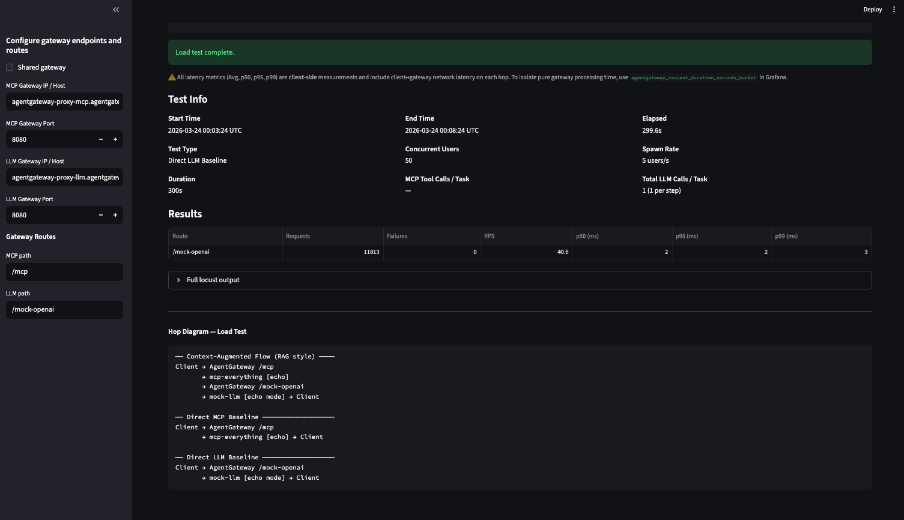
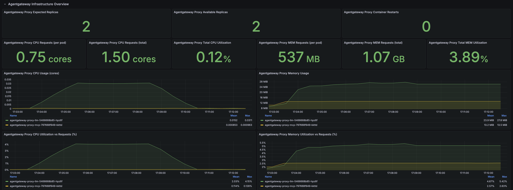
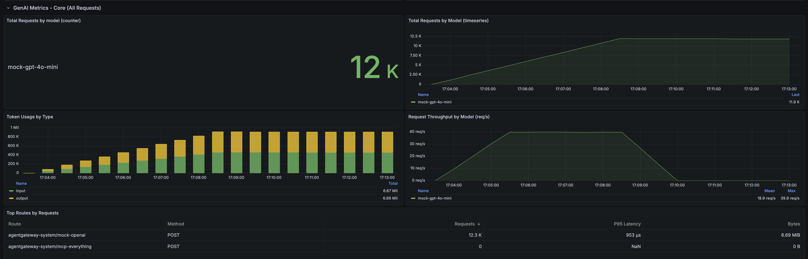
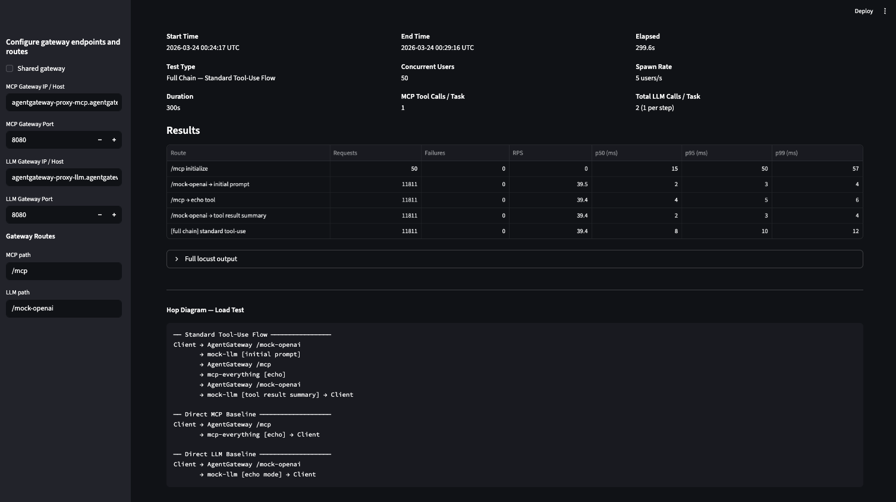
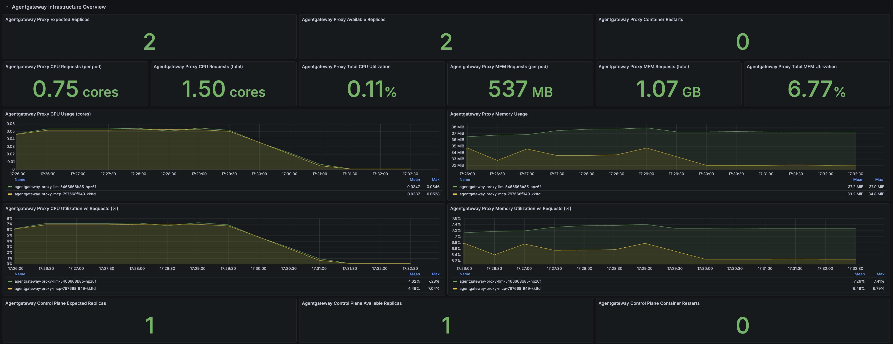
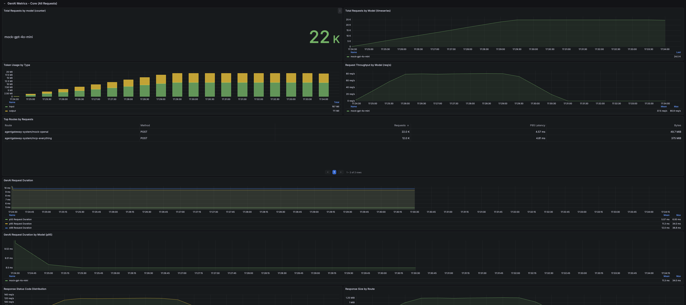
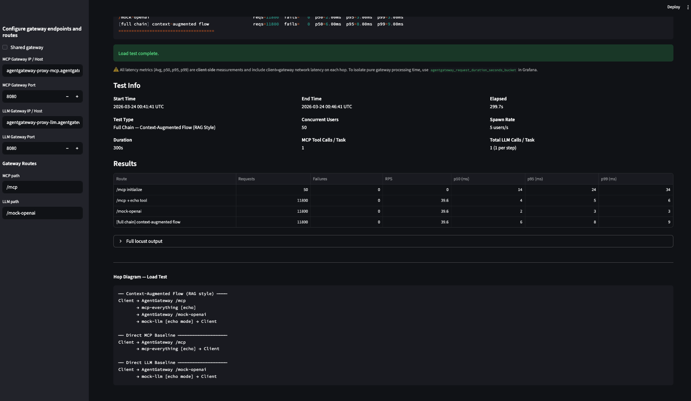
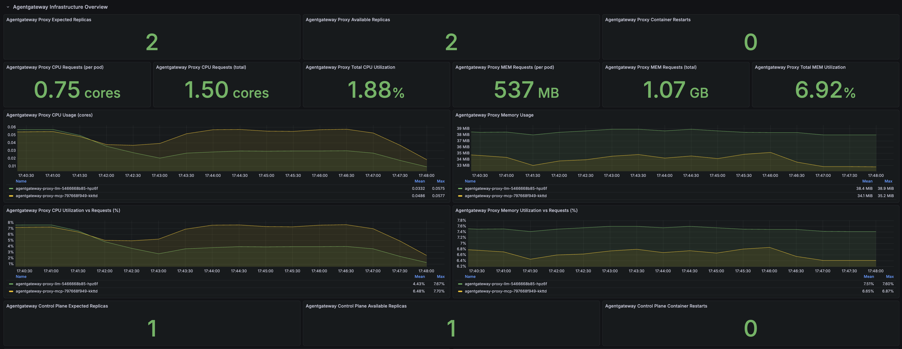
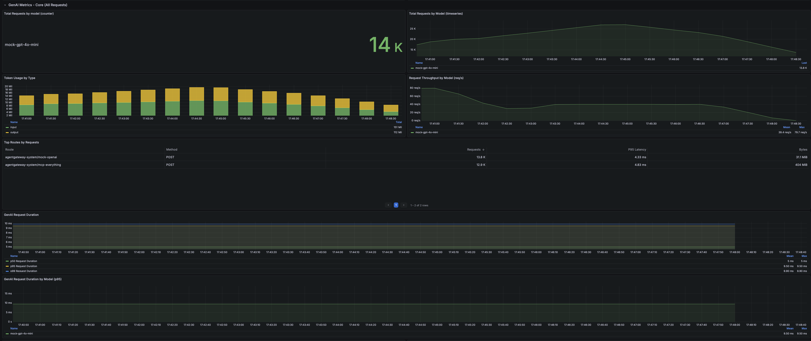
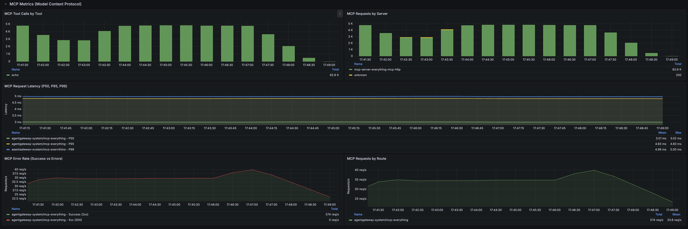

# Scenario 1b Results
Duration 300 seconds (5 mins)
LLM Payload size: 256 B
MCP Payload Size: 32 KB

- AGW > LLM Baseline (1x LLM call)
- AGW > MCP Baseline (1x MCP tool call)
- Full Chain
    - Standard Tool Use Flow
        - 1x LLM call + 2x MCP Tool Calls x 1x LLM call
    - Context-Augmented Flow (RAG style)
        - 2x MCP tool calls x 1x LLM call

# Agentgateway to LLM Baseline (5-min)




```
Response time percentiles (approximated)
Type     Name                                                                                  50%    66%    75%    80%    90%    95%    98%    99%  99.9% 99.99%   100% # reqs
--------|--------------------------------------------------------------------------------|--------|------|------|------|------|------|------|------|------|------|------|------
POST     /mock-openai                                                                            2      2      2      2      2      2      2      3     11     16     21  11813
--------|--------------------------------------------------------------------------------|--------|------|------|------|------|------|------|------|------|------|------|------
         Aggregated                                                                              2      2      2      2      2      2      2      3     11     16     21  11813


=== Agentgateway Loadgen — Summary ===
Start:   2026-03-24 00:03:24 UTC
End:     2026-03-24 00:08:24 UTC
Elapsed: 299.6s
------
/mock-openai                                        reqs=11813  fails=   0  p50=2.00ms  p95=2.00ms  p99=3.00ms
=====================================
```

## Results compared to Scenario 1a
- Negligible difference between shared-proxy and dedicated for LLM access

>Shared gateway: p50=2.00ms  p95=2.00ms  p99=3.00ms

>Dedicated Gateways: p50=2.00ms  p95=2.00ms  p99=3.00ms

# Agentgateway to MCP Baseline (5-min)


```
Response time percentiles (approximated)
Type     Name                                                                                  50%    66%    75%    80%    90%    95%    98%    99%  99.9% 99.99%   100% # reqs
--------|--------------------------------------------------------------------------------|--------|------|------|------|------|------|------|------|------|------|------|------
POST     /mcp initialize                                                                        15     17     18     21     31     54     65     65     65     65     65     50
POST     /mcp → echo tool                                                                        4      4      4      4      5      5      5      6     11     18     25  11758
--------|--------------------------------------------------------------------------------|--------|------|------|------|------|------|------|------|------|------|------|------
         Aggregated                                                                              4      4      4      4      5      5      5      6     19     59     65  11808


=== Agentgateway Loadgen — Summary ===
Start:   2026-03-24 00:13:44 UTC
End:     2026-03-24 00:18:44 UTC
Elapsed: 299.6s
------
/mcp initialize                                     reqs=   50  fails=   0  p50=15.00ms  p95=54.00ms  p99=65.00ms
/mcp → echo tool                                    reqs=11758  fails=   0  p50=4.00ms  p95=5.00ms  p99=6.00ms
=====================================
```

## Results compared to Scenario 1a
- Negligible difference between shared-proxy and dedicated for MCP access

>Shared gateway: p50=4.00ms  p95=5.00ms  p99=6.00ms

>Dedicated Gateways: p50=4.00ms  p95=5.00ms  p99=6.00ms

# Full Chain - Standard Tool Use Flow (5 mins)





```
Response time percentiles (approximated)
Type     Name                                                                                  50%    66%    75%    80%    90%    95%    98%    99%  99.9% 99.99%   100% # reqs
--------|--------------------------------------------------------------------------------|--------|------|------|------|------|------|------|------|------|------|------|------
POST     /mcp initialize                                                                        15     16     17     19     43     50     57     57     57     57     57     50
POST     /mcp → echo tool                                                                        4      4      4      4      4      5      5      6     11     17     18  11811
POST     /mock-openai → initial prompt                                                           2      2      2      2      3      3      3      4     12     18     18  11811
POST     /mock-openai → tool result summary                                                      2      2      2      2      3      3      3      4      5     15     15  11811
CHAIN    [full chain] standard tool-use                                                          8      8      9      9     10     10     11     12     23     28     28  11811
--------|--------------------------------------------------------------------------------|--------|------|------|------|------|------|------|------|------|------|------|------
         Aggregated                                                                              3      4      7      8      8      9     10     11     18     43     57  47294


=== Agentgateway Loadgen — Summary ===
Start:   2026-03-24 00:24:17 UTC
End:     2026-03-24 00:29:16 UTC
Elapsed: 299.6s
------
/mcp initialize                                     reqs=   50  fails=   0  p50=15.00ms  p95=50.00ms  p99=57.00ms
/mock-openai → initial prompt                       reqs=11811  fails=   0  p50=2.00ms  p95=3.00ms  p99=4.00ms
/mcp → echo tool                                    reqs=11811  fails=   0  p50=4.00ms  p95=5.00ms  p99=6.00ms
/mock-openai → tool result summary                  reqs=11811  fails=   0  p50=2.00ms  p95=3.00ms  p99=4.00ms
[full chain] standard tool-use                      reqs=11811  fails=   0  p50=8.00ms  p95=10.00ms  p99=12.00ms
=====================================
```

## Results compared to Scenario 1a
- Negligible difference between shared-proxy and dedicated for full chain standard tool use flow

>Shared gateway: p50=8.00ms  p95=10.00ms  p99=12.00ms

>Dedicated Gateways: p50=8.00ms  p95=10.00ms  p99=12.00ms

# Full Chain - Context-Augmented Flow (5 mins)





```
Response time percentiles (approximated)
Type     Name                                                                                  50%    66%    75%    80%    90%    95%    98%    99%  99.9% 99.99%   100% # reqs
--------|--------------------------------------------------------------------------------|--------|------|------|------|------|------|------|------|------|------|------|------
POST     /mcp initialize                                                                        14     17     19     20     24     24     34     34     34     34     34     50
POST     /mcp → echo tool                                                                        4      4      4      4      5      5      6      6     13     17     44  11800
POST     /mock-openai                                                                            2      2      2      2      2      3      3      3     11     34     35  11800
CHAIN    [full chain] context-augmented flow                                                     6      6      7      7      7      8      8      9     20     51     51  11800
--------|--------------------------------------------------------------------------------|--------|------|------|------|------|------|------|------|------|------|------|------
         Aggregated                                                                              4      5      6      6      7      7      8      8     18     49     51  35450


=== Agentgateway Loadgen — Summary ===
Start:   2026-03-24 00:41:41 UTC
End:     2026-03-24 00:46:41 UTC
Elapsed: 299.7s
------
/mcp initialize                                     reqs=   50  fails=   0  p50=14.00ms  p95=24.00ms  p99=34.00ms
/mcp → echo tool                                    reqs=11800  fails=   0  p50=4.00ms  p95=5.00ms  p99=6.00ms
/mock-openai                                        reqs=11800  fails=   0  p50=2.00ms  p95=3.00ms  p99=3.00ms
[full chain] context-augmented flow                 reqs=11800  fails=   0  p50=6.00ms  p95=8.00ms  p99=9.00ms
=====================================
```

## Results compared to Scenario 1a
- Negligible difference between shared-proxy and dedicated for full chain context augmented flow

>Shared gateway: p50=6.00ms  p95=8.00ms  p99=9.00ms

>Dedicated Gateways: p50=6.00ms  p95=8.00ms  p99=9.00ms