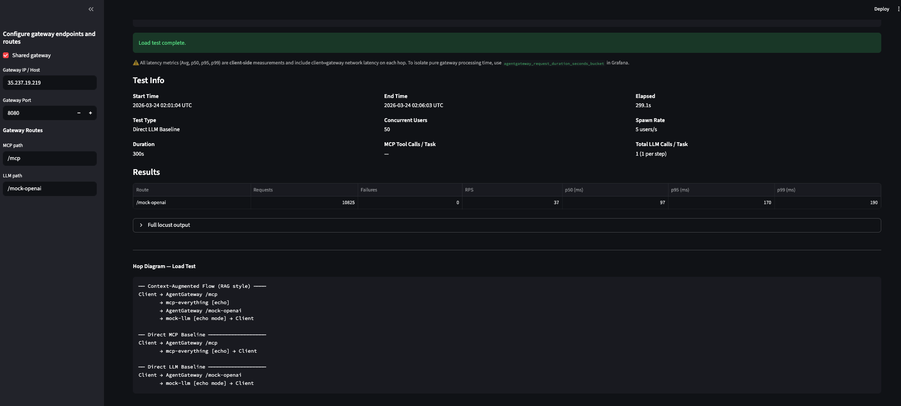
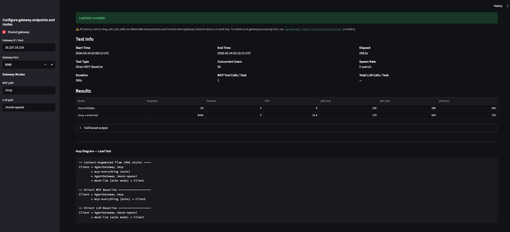
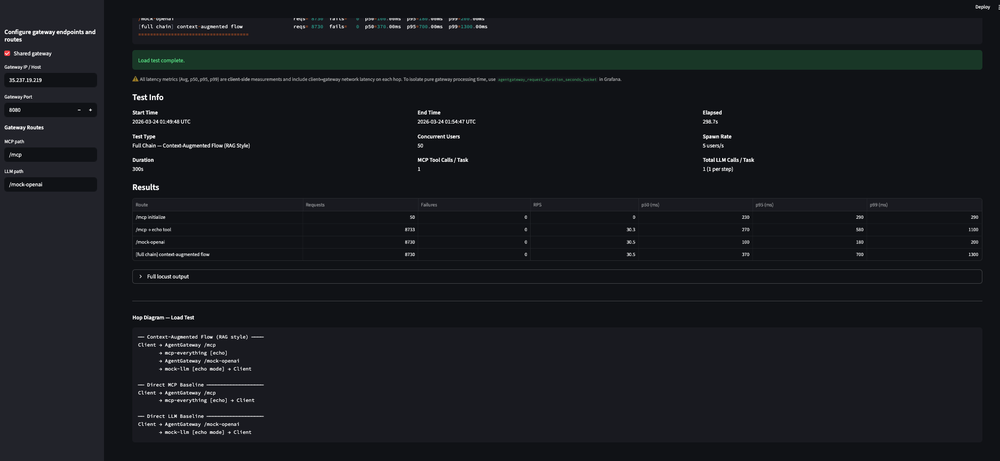
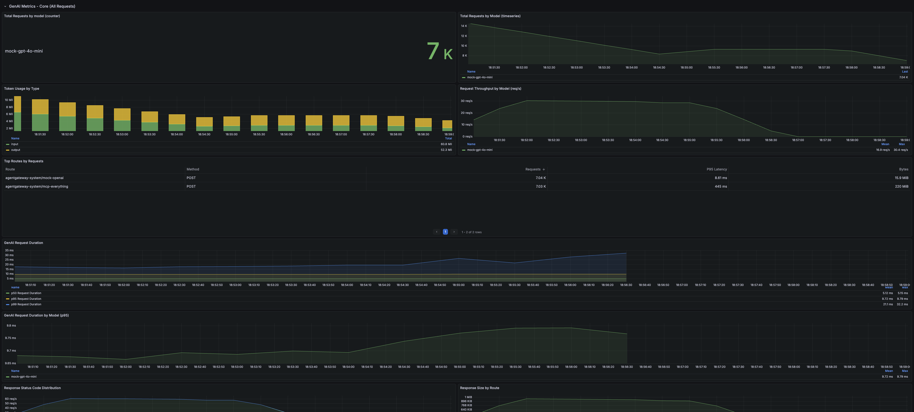
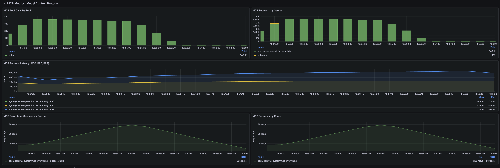

# Scenario 1c Results
Duration 300 seconds (5 mins)
LLM Payload size: 256 B
MCP Payload Size: 32 KB
25 concurrent users per client (50 total across both clients)

- AGW > LLM Baseline (1x LLM call)
- AGW > MCP Baseline (1x MCP tool call)
- Full Chain
    - Standard Tool Use Flow
        - 1x LLM call + 2x MCP Tool Calls x 1x LLM call
    - Context-Augmented Flow (RAG style)
        - 2x MCP tool calls x 1x LLM call

# Agentgateway to LLM Baseline (5-min)



```
Response time percentiles (approximated)
Type     Name                                                                                  50%    66%    75%    80%    90%    95%    98%    99%  99.9% 99.99%   100% # reqs
--------|--------------------------------------------------------------------------------|--------|------|------|------|------|------|------|------|------|------|------|------
POST     /mock-openai                                                                           97    100    120    130    160    170    180    190    290    330    520  10825
--------|--------------------------------------------------------------------------------|--------|------|------|------|------|------|------|------|------|------|------|------
         Aggregated                                                                             97    100    120    130    160    170    180    190    290    330    520  10825


=== Agentgateway Loadgen — Summary ===
Start:   2026-03-24 02:01:04 UTC
End:     2026-03-24 02:06:03 UTC
Elapsed: 299.1s
------
/mock-openai                                        reqs=10825  fails=   0  p50=97.00ms  p95=170.00ms  p99=190.00ms
=====================================
```

## Results compared to Scenario 1a
- External load balancer hop cost included in the call chain can be significant

>Client in-network of gateway: p50=2.00ms  p95=2.00ms  p99=3.00ms

>Client external to gateway: p50=97.00ms  p95=170.00ms  p99=190.00ms

# Agentgateway to MCP Baseline (5-min)



```
Response time percentiles (approximated)
Type     Name                                                                                  50%    66%    75%    80%    90%    95%    98%    99%  99.9% 99.99%   100% # reqs
--------|--------------------------------------------------------------------------------|--------|------|------|------|------|------|------|------|------|------|------|------
POST     /mcp initialize                                                                       220    230    250    260    290    290    290    290    290    290    290     50
POST     /mcp → echo tool                                                                      270    300    350    380    580    640    690    720   1300   1700   1700   9444
--------|--------------------------------------------------------------------------------|--------|------|------|------|------|------|------|------|------|------|------|------
         Aggregated                                                                            260    300    350    380    580    640    690    720   1300   1700   1700   9494


=== Agentgateway Loadgen — Summary ===
Start:   2026-03-24 02:08:13 UTC
End:     2026-03-24 02:13:12 UTC
Elapsed: 298.8s
------
/mcp initialize                                     reqs=   50  fails=   0  p50=220.00ms  p95=290.00ms  p99=290.00ms
/mcp → echo tool                                    reqs= 9444  fails=   0  p50=270.00ms  p95=640.00ms  p99=720.00ms
=====================================
```

## Results compared to Scenario 1a
- External load balancer hop cost included in the call chain can be significant

>Client in-network of gateway: p50=4.00ms  p95=5.00ms  p99=6.00ms

>Client external to gateway: p50=270.00ms  p95=640.00ms  p99=720.00ms

# Full Chain - Standard Tool Use Flow (5 mins)


```
Response time percentiles (approximated)
Type     Name                                                                                  50%    66%    75%    80%    90%    95%    98%    99%  99.9% 99.99%   100% # reqs
--------|--------------------------------------------------------------------------------|--------|------|------|------|------|------|------|------|------|------|------|------
POST     /mcp initialize                                                                       220    230    260    260    270    290    300    300    300    300    300     50
POST     /mcp → echo tool                                                                      200    230    260    270    350    430    520    610    960   1100   1100   8511
POST     /mock-openai → initial prompt                                                         100    110    130    140    170    180    200    230    780   1100   1100   8518
POST     /mock-openai → tool result summary                                                    100    110    120    120    160    190    220    270    760   1000   1000   8507
CHAIN    [full chain] standard tool-use                                                        450    470    480    490    610    700    870   1000   1400   1800   1800   8507
--------|--------------------------------------------------------------------------------|--------|------|------|------|------|------|------|------|------|------|------|------
         Aggregated                                                                            190    230    390    420    460    500    660    750   1200   1500   1800  34093


=== Agentgateway Loadgen — Summary ===
Start:   2026-03-24 01:41:42 UTC
End:     2026-03-24 01:46:40 UTC
Elapsed: 298.2s
------
/mcp initialize                                     reqs=   50  fails=   0  p50=220.00ms  p95=290.00ms  p99=300.00ms
/mock-openai → initial prompt                       reqs= 8518  fails=   0  p50=100.00ms  p95=180.00ms  p99=230.00ms
/mcp → echo tool                                    reqs= 8511  fails=   0  p50=200.00ms  p95=430.00ms  p99=610.00ms
/mock-openai → tool result summary                  reqs= 8507  fails=   0  p50=100.00ms  p95=190.00ms  p99=270.00ms
[full chain] standard tool-use                      reqs= 8507  fails=   0  p50=450.00ms  p95=700.00ms  p99=1000.00ms
=====================================
```

## Results compared to Scenario 1a
- External load balancer hop cost included in the call chain can be significant

>Client in-network of gateway: p50=8.00ms  p95=10.00ms  p99=12.00ms

>Client external to gateway: p50=450.00ms  p95=700.00ms  p99=1000.00ms

# Full Chain - Context-Augmented Flow (5 mins)





```
Response time percentiles (approximated)
Type     Name                                                                                  50%    66%    75%    80%    90%    95%    98%    99%  99.9% 99.99%   100% # reqs
--------|--------------------------------------------------------------------------------|--------|------|------|------|------|------|------|------|------|------|------|------
POST     /mcp initialize                                                                       230    250    250    250    290    290    290    290    290    290    290     50
POST     /mcp → echo tool                                                                      270    310    370    420    510    580    840   1100   3000   3600   3600   8733
POST     /mock-openai                                                                          100    110    110    120    150    180    190    200    910   2100   2100   8730
CHAIN    [full chain] context-augmented flow                                                   370    430    480    530    620    700   1000   1300   3200   3700   3700   8730
--------|--------------------------------------------------------------------------------|--------|------|------|------|------|------|------|------|------|------|------|------
         Aggregated                                                                            270    330    370    410    520    610    770   1000   3000   3400   3700  26243


=== Agentgateway Loadgen — Summary ===
Start:   2026-03-24 01:49:48 UTC
End:     2026-03-24 01:54:47 UTC
Elapsed: 298.7s
------
/mcp initialize                                     reqs=   50  fails=   0  p50=230.00ms  p95=290.00ms  p99=290.00ms
/mcp → echo tool                                    reqs= 8733  fails=   0  p50=270.00ms  p95=580.00ms  p99=1100.00ms
/mock-openai                                        reqs= 8730  fails=   0  p50=100.00ms  p95=180.00ms  p99=200.00ms
[full chain] context-augmented flow                 reqs= 8730  fails=   0  p50=370.00ms  p95=700.00ms  p99=1300.00ms
=====================================
```

## Results compared to Scenario 1a
- Load balancer hop cost included in the call chain can be significant

>Client in-network of gateway: p50=6.00ms  p95=8.00ms  p99=9.00ms

>Client external to gateway: p50=370.00ms  p95=700.00ms  p99=1300.00ms