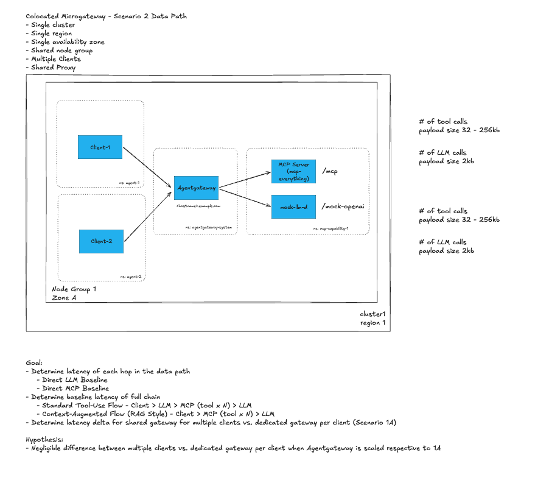
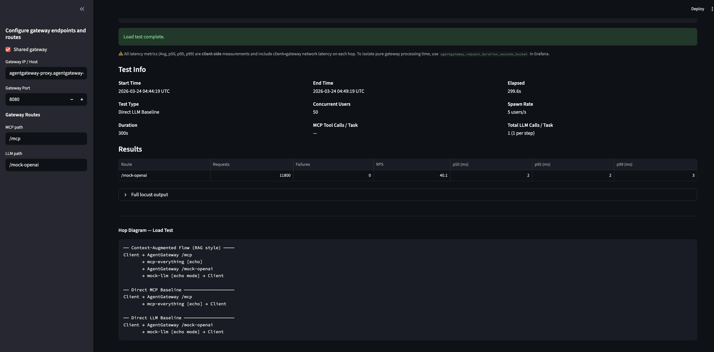
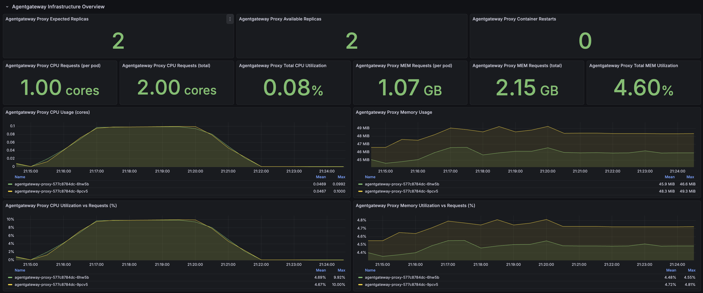
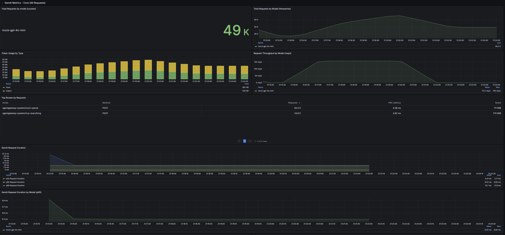
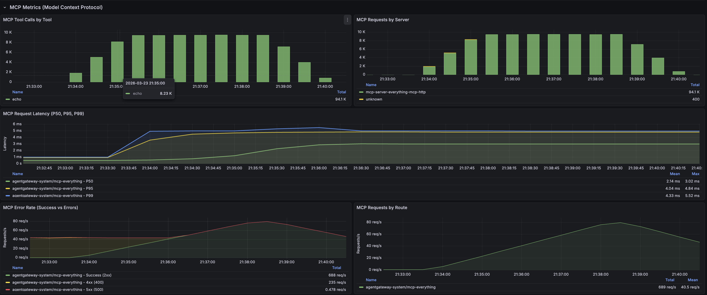

# Scenario 2: Colocated Microgateway — Multiple Clients, Shared Proxy

> **Goal**: Determine latency of each hop in the data path (Direct LLM Baseline, Direct MCP Baseline), determine baseline latency of full chain (Standard Tool-Use Flow and Context-Augmented/RAG Flow), and determine latency delta for a shared gateway with multiple clients vs. a dedicated gateway per client (Scenario 1a).
>
> **Hypothesis**: Negligible difference between multiple clients vs. dedicated gateway per client when Agentgateway is scaled respective to Scenario 1a.
>
> **Setup**: Single cluster, single region, single availability zone, shared node group, multiple clients, shared proxy.

## Architecture

> Single cluster · Single region · Single AZ · Isolated node groups · Multiple clients · Shared proxy




## Components

| Component | Namespace | Replicas | Notes |
|-----------|-----------|----------|-------|
| `loadgen-client-1` | `agent-1` | 1 | Locust load test client |
| `loadgen-client-2` | `agent-2` | 1 | Locust load test client |
| `loadgen-client-3` | `agent-3` | 1 | Locust load test client |
| `loadgen-client-4` | `agent-4` | 1 | Optional 4th client |
| `loadgen-client-5` | `agent-5` | 1 | Optional 5th client |
| `agentgateway` | `agentgateway-system` | 2 | Shared gateway for all clients |
| `mcp-server-everything` | `ai-platform` | 3 | Reference MCP server |
| `mock-llm-d` | `ai-platform` | 1 | Mock OpenAI-compatible LLM inference service (llm-d-inference-sim) |
| `prometheus` | `monitoring` | 1 | Metrics |
| `grafana` | `monitoring` | 1 | Dashboards |

---

## Prerequisites

Complete the following steps before running this scenario:

1. Create the GKE cluster — follow [`gke/main-cluster-gke.md`](../gke/main-cluster-gke.md)
2. [001 - Set Up Enterprise AgentGateway](../scenario-1a/installation-steps/001-set-up-enterprise-agentgateway.md)
3. [002 - Set Up Monitoring Tools](../scenario-1a/installation-steps/002-set-up-monitoring-tools.md)

> **Coming from Scenario 1b?** See [`installation-steps/004-reconfigure-for-scenario-2.md`](./installation-steps/004-reconfigure-for-scenario-2.md) for instructions and scripts to convert an existing 1b deployment to Scenario 2.

Additionally ensure the following are available:
- `kubectl` configured against the target cluster
- `helm`, `jq`, `curl`, Python 3.11+

---

## Quick Start

```bash
chmod +x setup-script.sh
./setup-script.sh
```

The script walks through steps interactively:
1. Configure AgentGateway proxy service type (LoadBalancer or ClusterIP)
2. Deploy MCP everything server + mock-llm to `ai-platform` namespace
3. Apply AgentGateway HTTPRoutes and backends
4. Retrieve Gateway IP (or set up port-forward)
5. Choose client count (1-5, default 3) -- agent namespaces (`agent-1` ... `agent-N`) are created automatically
6. Choose client mode (local Python or k8s in-cluster)
7. Print per-client port-forward commands / open browser tabs

---

## Test Steps

### 1. Setup

Scale MCP and LLM deployments for load testing:

```bash
kubectl scale -n ai-platform deploy/mcp-server-everything --replicas 3
kubectl scale -n ai-platform deploy/mock-llm --replicas 3
```

### 2. Client Configuration

Configure the following in **each** Streamlit UI (Client 1, 2, 3):

- Use default shared gateway
- Gateway IP / Host: `agentgateway-proxy.agentgateway-system.svc.cluster.local`
- Gateway Port: `8000`
- MCP Path: `/mcp`
- LLM Path: `/mock-openai`

Access each client UI via port-forward:

```bash
kubectl port-forward -n agent-1 svc/loadgen-client-1 8501:8501 &
kubectl port-forward -n agent-2 svc/loadgen-client-2 8502:8501 &
kubectl port-forward -n agent-3 svc/loadgen-client-3 8503:8501 &

open http://localhost:8501  # Client 1
open http://localhost:8502  # Client 2
open http://localhost:8503  # Client 3
```

### 3. Load Test Parameters

Run simultaneously across all 3 clients:

- **Concurrent users per client**: 50 (150 total)
- **Spawn rate**: 5 users/s
- **Duration**: 300 seconds (5 mins)

### 4. Test Cases

Run each test case across **all clients simultaneously**:

1. **Direct LLM Baseline** (1x LLM call) -- LLM Payload size: 256 B
2. **Direct MCP Baseline** (1x MCP tool call) -- MCP Payload Size: 32 KB
3. **Full Chain -- Standard Tool Use Flow** -- 1x LLM call + 2x MCP Tool Calls + 1x LLM call (MCP Payload Size: 32 KB)
4. **Full Chain -- Context-Augmented Flow** (RAG style) -- 2x MCP tool calls + 1x LLM call (MCP Payload Size: 32 KB)

### 5. After Each Test

Rollout restart the backend servers before the next test run:

```bash
kubectl rollout restart -n ai-platform deployment mcp-server-everything
kubectl rollout restart -n ai-platform deployment mock-llm
```

---

## Results

**Test parameters**: 50 VU per client, spawn rate 5 users/s, 3 concurrent clients (agent-1, agent-2, agent-3) for 150 total concurrent users, duration 300 seconds (5 mins), LLM Payload size 256 B, MCP Payload Size 32 KB.

### Agentgateway to LLM Baseline (5-min, 3 clients)




#### Client 1

| Endpoint | Reqs | Fails | p50 | p95 | p99 |
|----------|------|-------|-----|-----|-----|
| /mock-openai | 11,812 | 0 | 2ms | 2ms | 3ms |
| /mock-openai | 11,812 | 0 | 2ms | 2ms | 3ms |
| /mcp initialize | 50 | 0 | 13ms | 21ms | 26ms |
| /mcp → echo tool | 11,722 | 0 | 4ms | 4ms | 6ms |

**Duration:** 4m 59s (2026-03-24 05:05:01 UTC → 2026-03-24 05:10:01 UTC)

#### Client 2

| Endpoint | Reqs | Fails | p50 | p95 | p99 |
|----------|------|-------|-----|-----|-----|
| /mcp initialize | 50 | 0 | 13ms | 19ms | 25ms |
| /mcp → echo tool | 11,783 | 0 | 4ms | 4ms | 6ms |

**Duration:** 4m 59s (2026-03-24 05:14:00 UTC → 2026-03-24 05:19:00 UTC)

#### Comparison to Scenario 1a Baseline

- Negligible difference between single and multi-client for full chain standard tool use flow
- Slight increase in CPU usage

> Scenario 1a (1 client):  p50=4ms  p95=5ms  p99=6ms
>
> Scenario 2  (client 1): p50=4ms  p95=4ms  p99=6ms
>
> Scenario 2  (client 2): p50=4ms  p95=4ms  p99=6ms

---

### Full Chain -- Standard Tool Use Flow (5 mins, 3 clients)






#### Client 1

| Endpoint | Reqs | Fails | p50 | p95 | p99 |
|----------|------|-------|-----|-----|-----|
| /mcp initialize | 50 | 0 | 14ms | 62ms | 66ms |
| /mock-openai → initial prompt | 11,742 | 0 | 2ms | 3ms | 4ms |
| /mcp → echo tool | 11,742 | 0 | 4ms | 5ms | 6ms |
| /mock-openai → tool result summary | 11,741 | 0 | 2ms | 3ms | 4ms |
| [full chain] standard tool-use | 11,741 | 0 | 8ms | 10ms | 12ms |

**Duration:** 4m 59s (2026-03-24 04:14:59 UTC → 2026-03-24 04:19:59 UTC)

#### Client 2

| Endpoint | Reqs | Fails | p50 | p95 | p99 |
|----------|------|-------|-----|-----|-----|
| /mcp initialize | 50 | 0 | 14ms | 22ms | 23ms |
| /mock-openai → initial prompt | 11,758 | 0 | 2ms | 3ms | 4ms |
| /mcp → echo tool | 11,758 | 0 | 4ms | 5ms | 6ms |
| /mock-openai → tool result summary | 11,758 | 0 | 2ms | 3ms | 4ms |
| [full chain] standard tool-use | 11,758 | 0 | 8ms | 10ms | 12ms |

**Duration:** 4m 59s (2026-03-24 04:15:04 UTC → 2026-03-24 04:20:03 UTC)

#### Comparison to Scenario 1a Baseline

- Negligible difference between single and multi-client for full chain standard tool use flow
- Slight increase in CPU usage

> Scenario 1a (1 client):  p50=8ms  p95=10ms  p99=12ms
>
> Scenario 2  (client 1): p50=8ms  p95=10ms  p99=12ms
>
> Scenario 2  (client 2): p50=8ms  p95=10ms  p99=12ms

---

### Full Chain -- Context-Augmented Flow (5 mins, 3 clients)




#### Client 1

| Endpoint | Reqs | Fails | p50 | p95 | p99 |
|----------|------|-------|-----|-----|-----|
| /mcp initialize | 50 | 0 | 13ms | 47ms | 77ms |
| /mcp → echo tool | 11,769 | 0 | 4ms | 5ms | 6ms |
| /mock-openai | 11,769 | 0 | 2ms | 3ms | 3ms |
| [full chain] context-augmented flow | 11,769 | 0 | 6ms | 8ms | 9ms |

**Duration:** 4m 59s (2026-03-24 04:33:09 UTC → 2026-03-24 04:38:09 UTC)

#### Client 2

| Endpoint | Reqs | Fails | p50 | p95 | p99 |
|----------|------|-------|-----|-----|-----|
| /mcp initialize | 50 | 0 | 15ms | 24ms | 78ms |
| /mcp → echo tool | 11,767 | 0 | 4ms | 5ms | 6ms |
| /mock-openai | 11,767 | 0 | 2ms | 3ms | 3ms |
| [full chain] context-augmented flow | 11,767 | 0 | 6ms | 7ms | 9ms |

**Duration:** 4m 59s (2026-03-24 04:33:13 UTC → 2026-03-24 04:38:12 UTC)

#### Comparison to Scenario 1a Baseline

> Scenario 1a (1 client):  p50=6ms  p95=8ms  p99=9ms
>
> Scenario 2  (client 1): p50=6ms  p95=8ms  p99=9ms
>
> Scenario 2  (client 2): p50=6ms  p95=7ms  p99=9ms

---

## Observability

```bash
# AgentGateway request logs
kubectl logs -n agentgateway-system deploy/agentgateway -f

# MCP server logs
kubectl logs -n ai-platform deploy/mcp-server-everything -f

# Prometheus port-forward
kubectl port-forward -n monitoring svc/grafana-prometheus-kube-pr-prometheus 9090:9090
open http://localhost:9090
```

Key Prometheus queries:

```promql
# P99 latency per route (gateway-side, excludes client<>LB hop)
histogram_quantile(0.99, sum by (le, route) (rate(agentgateway_request_duration_seconds_bucket[5m])))

# Request throughput per route (requests/sec) — all clients combined
sum by (route) (rate(agentgateway_requests_total[1m]))

# Error rate per route
sum by (route) (rate(agentgateway_requests_total{status=~"5.."}[1m]))

# Total concurrent request rate (all clients)
sum(rate(agentgateway_requests_total[1m]))
```

---

## File Structure

```
scenario-2/
├── README.md
├── setup-script.sh
├── cleanup.sh
├── k8s/
│   ├── agent-1-deployment.yaml
│   ├── agent-2-deployment.yaml
│   ├── agent-3-deployment.yaml
│   ├── agent-4-deployment.yaml
│   ├── agent-5-deployment.yaml
│   ├── mcp-everything-deployment.yaml
│   └── mock-llm-deployment.yaml
├── route/
│   ├── mcp-everything-httproute.yaml
│   ├── mcp-everything-backend.yaml
│   ├── mock-openai-httproute.yaml
│   └── mock-openai-backend.yaml
├── images/                             # Locust & Grafana screenshots
└── installation-steps/
    ├── 004-reconfigure-for-scenario-2.md       # Instructions to convert 1b → 2
    ├── reconfigure-for-scenario-2.sh            # Script to convert 1b → 2
    └── lib/
        └── observability/
            └── agentgateway-grafana-dashboard-v1.json
```
