# Scenario 2 Results

3 concurrent clients (agent-1, agent-2, agent-3), each running 50 users → 150 total concurrent users
Duration: 300 seconds (5 mins)
LLM Payload size: 256 B
MCP Payload Size: 32 KB

- AGW > LLM Baseline (1x LLM call)
- AGW > MCP Baseline (1x MCP tool call)
- Full Chain
    - Standard Tool Use Flow
        - 1x LLM call + 2x MCP Tool Calls + 1x LLM call
    - Context-Augmented Flow (RAG style)
        - 2x MCP tool calls + 1x LLM call

---

# Scenario 2 - Agentgateway to LLM Baseline (5-min, 3 clients)

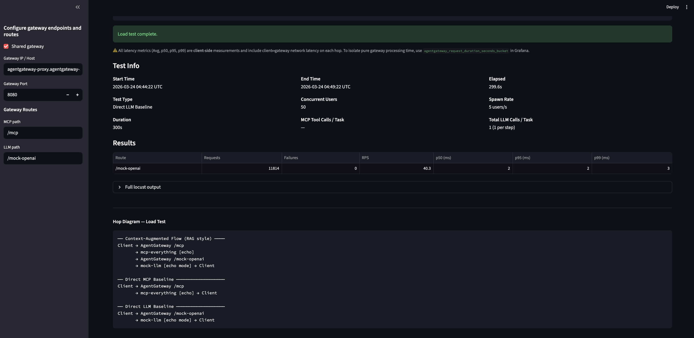
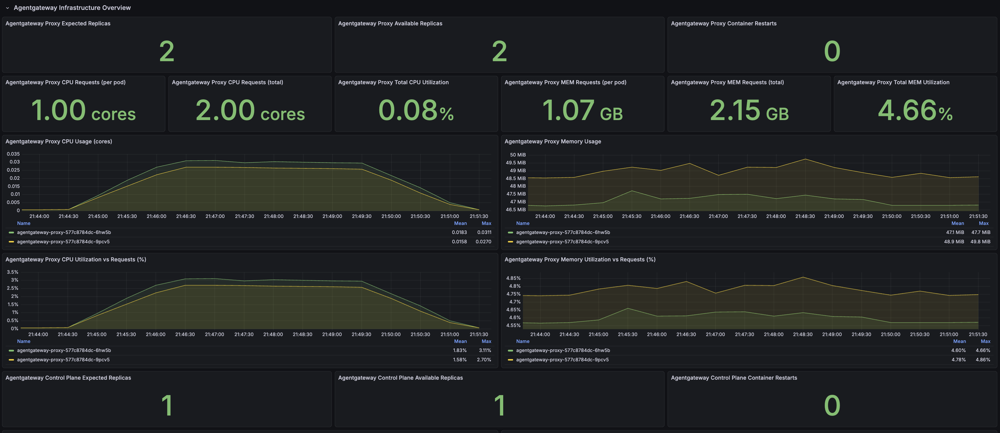
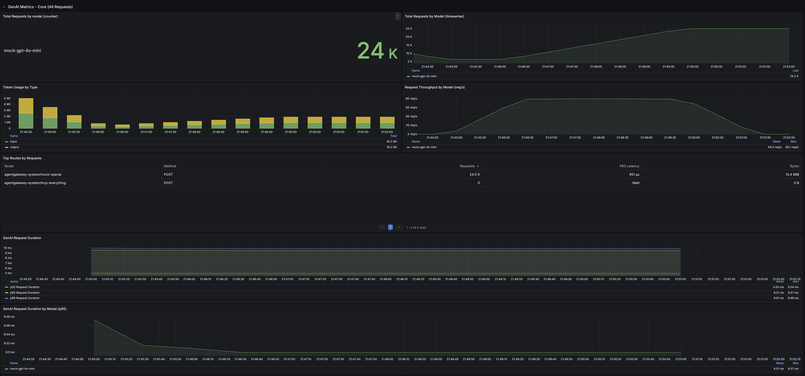

## client 1
```
Response time percentiles (approximated)
Type     Name                                                                                  50%    66%    75%    80%    90%    95%    98%    99%  99.9% 99.99%   100% # reqs
--------|--------------------------------------------------------------------------------|--------|------|------|------|------|------|------|------|------|------|------|------
POST     /mock-openai                                                                            2      2      2      2      2      2      2      3     10     35     41  11812
--------|--------------------------------------------------------------------------------|--------|------|------|------|------|------|------|------|------|------|------|------
         Aggregated                                                                              2      2      2      2      2      2      2      3     10     35     41  11812


=== Agentgateway Loadgen — Summary ===
Start:   2026-03-24 05:05:01 UTC
End:     2026-03-24 05:10:01 UTC
Elapsed: 299.6s
------
/mock-openai                                        reqs=11812  fails=   0  p50=2.00ms  p95=2.00ms  p99=3.00ms
```

## client 2
```
Response time percentiles (approximated)
Type     Name                                                                                  50%    66%    75%    80%    90%    95%    98%    99%  99.9% 99.99%   100% # reqs
--------|--------------------------------------------------------------------------------|--------|------|------|------|------|------|------|------|------|------|------|------
POST     /mock-openai                                                                            2      2      2      2      2      2      2      3     10     35     41  11812
--------|--------------------------------------------------------------------------------|--------|------|------|------|------|------|------|------|------|------|------|------
         Aggregated                                                                              2      2      2      2      2      2      2      3     10     35     41  11812


=== Agentgateway Loadgen — Summary ===
Start:   2026-03-24 05:05:01 UTC
End:     2026-03-24 05:10:01 UTC
Elapsed: 299.6s
------
/mock-openai                                        reqs=11812  fails=   0  p50=2.00ms  p95=2.00ms  p99=3.00ms
```

## Results compared to Scenario 1a baseline
- Negligible difference between single and multi-client for full chain standard tool use flow
- Slight increase in CPU usage

> Scenario 1a (1 client):  p50=2.00ms  p95=2.00ms  p99=3.00ms
>
> Scenario 2  (client 1): p50=2.00ms  p95=2.00ms  p99=3.00ms
>
> Scenario 2  (client 2): p50=2.00ms  p95=2.00ms  p99=3.00ms

---

# Scenario 2 - Agentgateway to MCP Baseline (5-min, 3 clients)
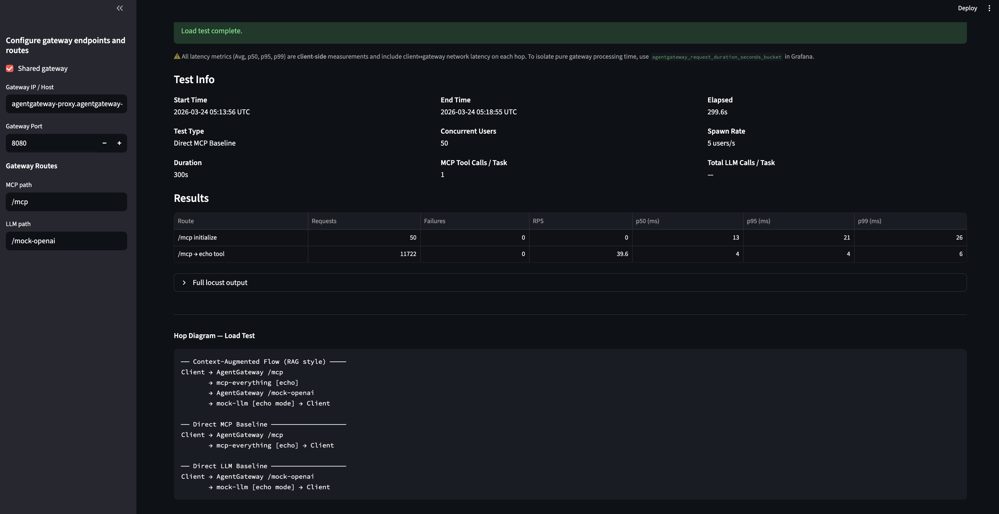
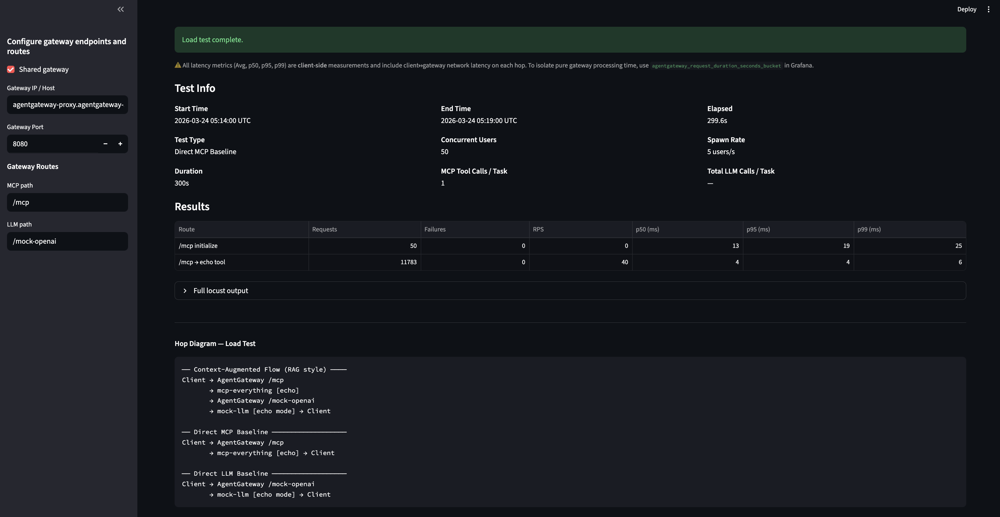
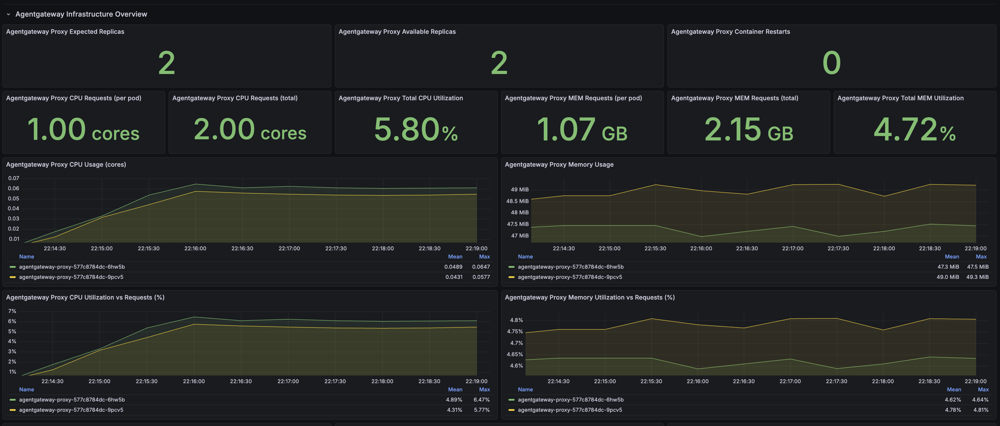
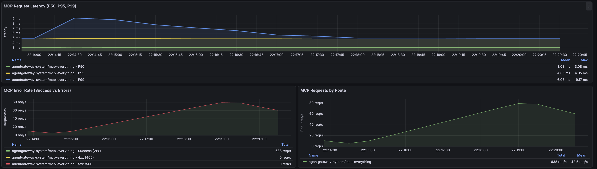

## client 1
```
Response time percentiles (approximated)
Type     Name                                                                                  50%    66%    75%    80%    90%    95%    98%    99%  99.9% 99.99%   100% # reqs
--------|--------------------------------------------------------------------------------|--------|------|------|------|------|------|------|------|------|------|------|------
POST     /mcp initialize                                                                        13     14     15     17     20     21     26     26     26     26     26     50
POST     /mcp → echo tool                                                                        4      4      4      4      4      4      5      6     13     20     21  11722
--------|--------------------------------------------------------------------------------|--------|------|------|------|------|------|------|------|------|------|------|------
         Aggregated                                                                              4      4      4      4      4      5      5      7     18     23     26  11772


=== Agentgateway Loadgen — Summary ===
Start:   2026-03-24 05:13:56 UTC
End:     2026-03-24 05:18:55 UTC
Elapsed: 299.6s
------
/mcp initialize                                     reqs=   50  fails=   0  p50=13.00ms  p95=21.00ms  p99=26.00ms
/mcp → echo tool                                    reqs=11722  fails=   0  p50=4.00ms  p95=4.00ms  p99=6.00ms
=====================================
```

## client 2
```
Response time percentiles (approximated)
Type     Name                                                                                  50%    66%    75%    80%    90%    95%    98%    99%  99.9% 99.99%   100% # reqs
--------|--------------------------------------------------------------------------------|--------|------|------|------|------|------|------|------|------|------|------|------
POST     /mcp initialize                                                                        13     14     15     16     19     19     25     25     25     25     25     50
POST     /mcp → echo tool                                                                        4      4      4      4      4      4      5      6     14     21     22  11783
--------|--------------------------------------------------------------------------------|--------|------|------|------|------|------|------|------|------|------|------|------
         Aggregated                                                                              4      4      4      4      4      4      5      7     17     22     25  11833


=== Agentgateway Loadgen — Summary ===
Start:   2026-03-24 05:14:00 UTC
End:     2026-03-24 05:19:00 UTC
Elapsed: 299.6s
------
/mcp initialize                                     reqs=   50  fails=   0  p50=13.00ms  p95=19.00ms  p99=25.00ms
/mcp → echo tool                                    reqs=11783  fails=   0  p50=4.00ms  p95=4.00ms  p99=6.00ms
=====================================
```

## Results compared to Scenario 1a baseline
- Negligible difference between single and multi-client for full chain standard tool use flow
- Slight increase in CPU usage

> Scenario 1a (1 client):  p50=4.00ms  p95=5.00ms  p99=6.00ms
>
> Scenario 2  (client 1): p50=4.00ms  p95=4.00ms  p99=6.00ms
>
> Scenario 2  (client 2): p50=4.00ms  p95=4.00ms  p99=6.00ms

---

# Full Chain - Standard Tool Use Flow (5 mins, 3 clients)

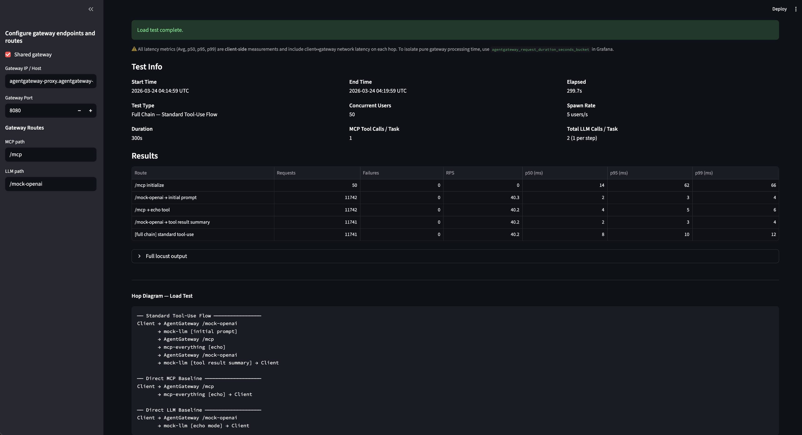
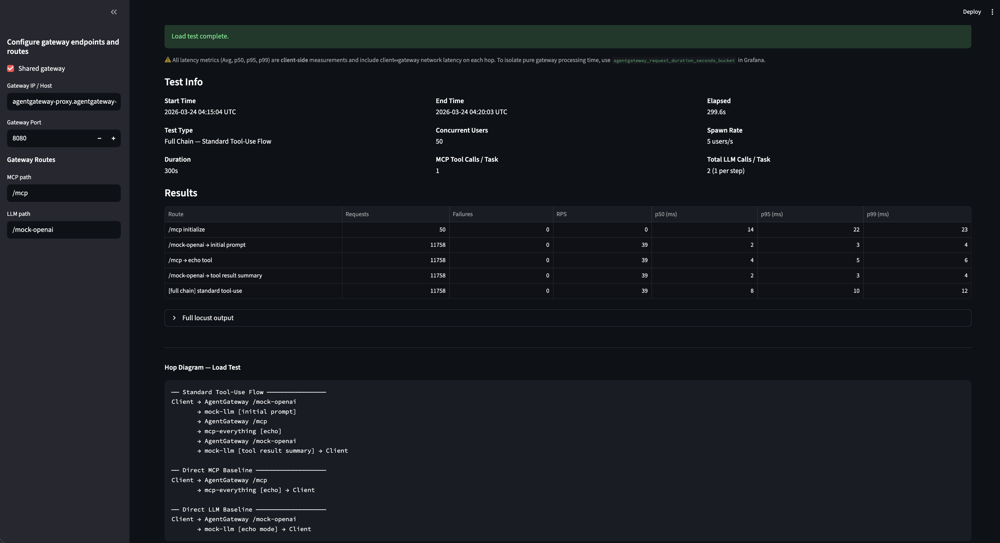


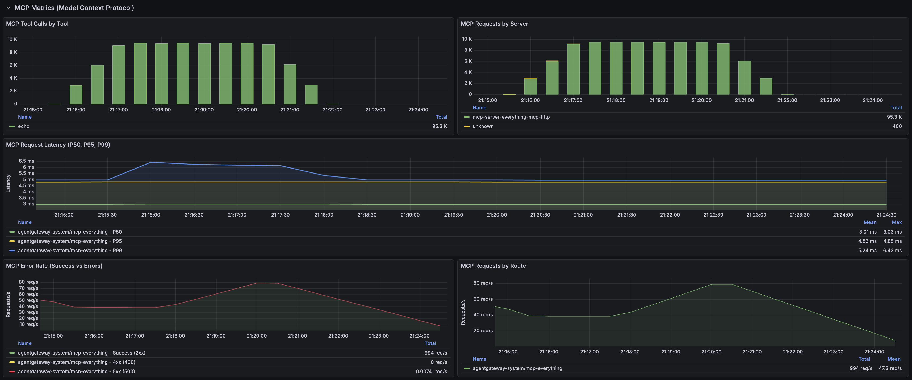


## Client 1
```
Response time percentiles (approximated)
Type     Name                                                                                  50%    66%    75%    80%    90%    95%    98%    99%  99.9% 99.99%   100% # reqs
--------|--------------------------------------------------------------------------------|--------|------|------|------|------|------|------|------|------|------|------|------
POST     /mcp initialize                                                                        14     17     18     19     51     62     66     66     66     66     66     50
POST     /mcp → echo tool                                                                        4      4      4      4      4      5      5      6      9     23     32  11742
POST     /mock-openai → initial prompt                                                           2      2      2      3      3      3      3      4      5     20     24  11742
POST     /mock-openai → tool result summary                                                      2      2      2      3      3      3      3      4      5     16     16  11741
CHAIN    [full chain] standard tool-use                                                          8      9      9      9     10     10     11     12     21     31     37  11741
--------|--------------------------------------------------------------------------------|--------|------|------|------|------|------|------|------|------|------|------|------
         Aggregated                                                                              3      4      7      8      8      9     10     11     16     51     66  47016


=== Agentgateway Loadgen — Summary ===
Start:   2026-03-24 04:14:59 UTC
End:     2026-03-24 04:19:59 UTC
Elapsed: 299.7s
------
/mcp initialize                                     reqs=   50  fails=   0  p50=14.00ms  p95=62.00ms  p99=66.00ms
/mock-openai → initial prompt                       reqs=11742  fails=   0  p50=2.00ms  p95=3.00ms  p99=4.00ms
/mcp → echo tool                                    reqs=11742  fails=   0  p50=4.00ms  p95=5.00ms  p99=6.00ms
/mock-openai → tool result summary                  reqs=11741  fails=   0  p50=2.00ms  p95=3.00ms  p99=4.00ms
[full chain] standard tool-use                      reqs=11741  fails=   0  p50=8.00ms  p95=10.00ms  p99=12.00ms
=====================================
```

## Client 2
```
Response time percentiles (approximated)
Type     Name                                                                                  50%    66%    75%    80%    90%    95%    98%    99%  99.9% 99.99%   100% # reqs
--------|--------------------------------------------------------------------------------|--------|------|------|------|------|------|------|------|------|------|------|------
POST     /mcp initialize                                                                        14     15     16     18     19     22     23     23     23     23     23     50
POST     /mcp → echo tool                                                                        4      4      4      4      4      5      5      6     10     46     47  11758
POST     /mock-openai → initial prompt                                                           2      2      2      3      3      3      3      4      5     17     43  11758
POST     /mock-openai → tool result summary                                                      2      2      2      3      3      3      3      4      5     18     45  11758
CHAIN    [full chain] standard tool-use                                                          8      9      9      9     10     10     11     12     24     53     54  11758
--------|--------------------------------------------------------------------------------|--------|------|------|------|------|------|------|------|------|------|------|------
         Aggregated                                                                              3      4      7      8      8      9     10     11     17     49     54  47082


=== Agentgateway Loadgen — Summary ===
Start:   2026-03-24 04:15:04 UTC
End:     2026-03-24 04:20:03 UTC
Elapsed: 299.6s
------
/mcp initialize                                     reqs=   50  fails=   0  p50=14.00ms  p95=22.00ms  p99=23.00ms
/mock-openai → initial prompt                       reqs=11758  fails=   0  p50=2.00ms  p95=3.00ms  p99=4.00ms
/mcp → echo tool                                    reqs=11758  fails=   0  p50=4.00ms  p95=5.00ms  p99=6.00ms
/mock-openai → tool result summary                  reqs=11758  fails=   0  p50=2.00ms  p95=3.00ms  p99=4.00ms
[full chain] standard tool-use                      reqs=11758  fails=   0  p50=8.00ms  p95=10.00ms  p99=12.00ms
=====================================
```

## Results compared to Scenario 1a baseline
- Negligible difference between single and multi-client for full chain standard tool use flow
- Slight increase in CPU usage

> Scenario 1a (1 client):  p50=8.00ms  p95=10.00ms  p99=12.00ms
>
> Scenario 2  (client 1): p50=8.00ms  p95=10.00ms  p99=12.00ms
>
> Scenario 2  (client 2): p50=8.00ms  p95=10.00ms  p99=12.00ms

---

# Full Chain - Context-Augmented Flow (5 mins, 3 clients)

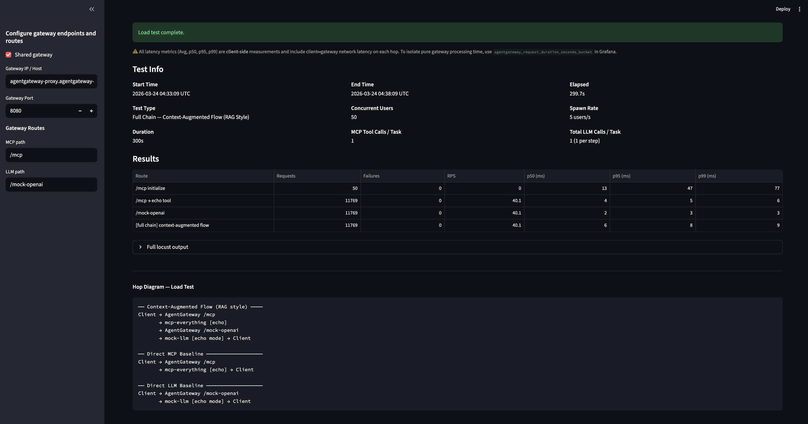
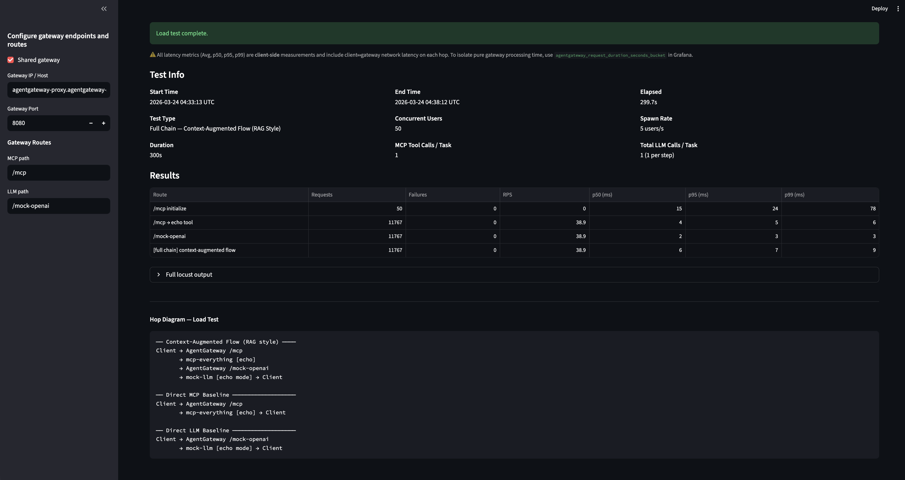
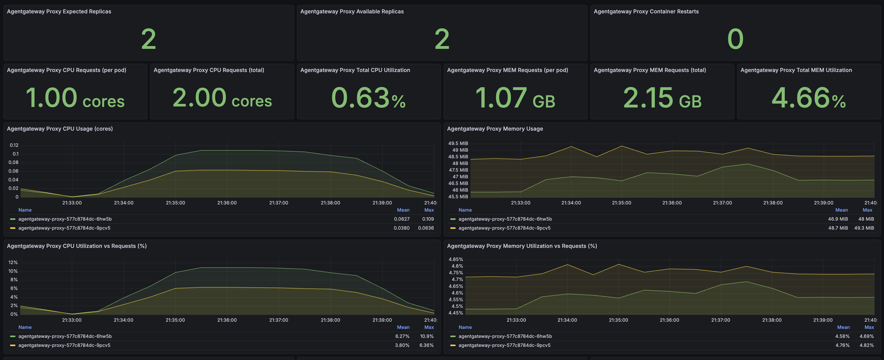
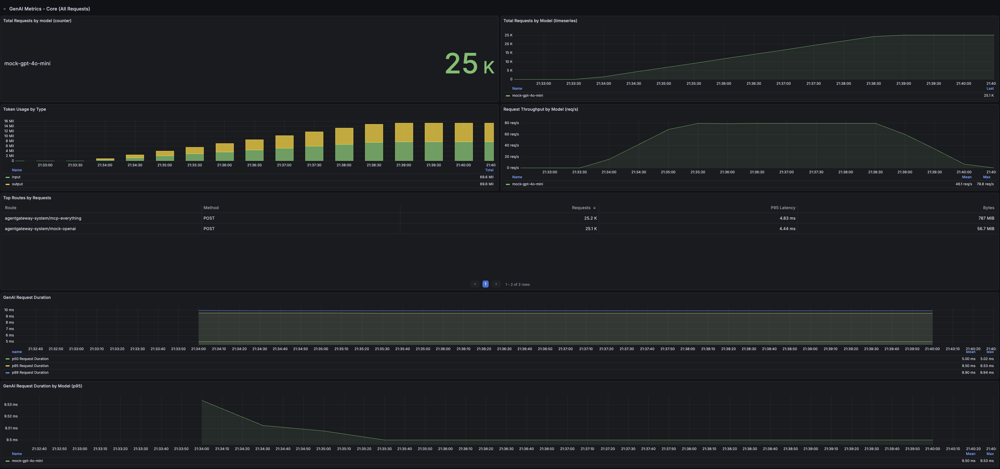


## client 1
```
Response time percentiles (approximated)
Type     Name                                                                                  50%    66%    75%    80%    90%    95%    98%    99%  99.9% 99.99%   100% # reqs
--------|--------------------------------------------------------------------------------|--------|------|------|------|------|------|------|------|------|------|------|------
POST     /mcp initialize                                                                        13     16     17     20     43     47     77     77     77     77     77     50
POST     /mcp → echo tool                                                                        4      4      4      4      5      5      5      6     11     19     19  11769
POST     /mock-openai                                                                            2      2      2      2      3      3      3      3      5     23     24  11769
CHAIN    [full chain] context-augmented flow                                                     6      6      7      7      7      8      8      9     19     34     34  11769
--------|--------------------------------------------------------------------------------|--------|------|------|------|------|------|------|------|------|------|------|------
         Aggregated                                                                              4      5      6      6      6      7      8      8     17     46     77  35357


=== Agentgateway Loadgen — Summary ===
Start:   2026-03-24 04:33:09 UTC
End:     2026-03-24 04:38:09 UTC
Elapsed: 299.7s
------
/mcp initialize                                     reqs=   50  fails=   0  p50=13.00ms  p95=47.00ms  p99=77.00ms
/mcp → echo tool                                    reqs=11769  fails=   0  p50=4.00ms  p95=5.00ms  p99=6.00ms
/mock-openai                                        reqs=11769  fails=   0  p50=2.00ms  p95=3.00ms  p99=3.00ms
[full chain] context-augmented flow                 reqs=11769  fails=   0  p50=6.00ms  p95=8.00ms  p99=9.00ms
=====================================
```

## client 2
```
Response time percentiles (approximated)
Type     Name                                                                                  50%    66%    75%    80%    90%    95%    98%    99%  99.9% 99.99%   100% # reqs
--------|--------------------------------------------------------------------------------|--------|------|------|------|------|------|------|------|------|------|------|------
POST     /mcp initialize                                                                        15     16     17     19     21     24     78     78     78     78     78     50
POST     /mcp → echo tool                                                                        4      4      4      4      5      5      5      6     11     21     22  11767
POST     /mock-openai                                                                            2      2      2      2      3      3      3      3      5     15     19  11767
CHAIN    [full chain] context-augmented flow                                                     6      6      7      7      7      7      8      9     15     23     25  11767
--------|--------------------------------------------------------------------------------|--------|------|------|------|------|------|------|------|------|------|------|------
         Aggregated                                                                              4      5      6      6      6      7      7      8     16     24     78  35351


=== Agentgateway Loadgen — Summary ===
Start:   2026-03-24 04:33:13 UTC
End:     2026-03-24 04:38:12 UTC
Elapsed: 299.7s
------
/mcp initialize                                     reqs=   50  fails=   0  p50=15.00ms  p95=24.00ms  p99=78.00ms
/mcp → echo tool                                    reqs=11767  fails=   0  p50=4.00ms  p95=5.00ms  p99=6.00ms
/mock-openai                                        reqs=11767  fails=   0  p50=2.00ms  p95=3.00ms  p99=3.00ms
[full chain] context-augmented flow                 reqs=11767  fails=   0  p50=6.00ms  p95=7.00ms  p99=9.00ms
=====================================
```

## Results compared to Scenario 1a baseline

> Scenario 1a (1 client):  p50=6.00ms  p95=8.00ms  p99=9.00ms
>
> Scenario 2  (client 1): p50=6.00ms  p95=8.00ms  p99=9.00ms
>
> Scenario 2  (client 2): p50=6.00ms  p95=7.00ms  p99=9.00ms
