# Scenario 3: Cross-Region Service Distribution — External Client via LoadBalancer

> **Goal**: Measure the NLB hop cost by routing the client through the external LoadBalancer IP rather than the internal cluster DNS. Latency delta vs Scenario 1a = NLB overhead.
>
> **Architecture**: Multi-cluster, multi-region, single availability zone with isolated node group, isolated proxy, and edge gateways. Single client connects cross-cluster or from outside the network.
>
> **Hypothesis**: Agentgateway-to-backend latency remains consistent. Variable network latency is expected from the Cloud Load Balancer hop. Standard regional network hop latency will be incurred as part of total latency but will remain negligible when a dedicated network backbone is provided (e.g. Direct Connect).

## Architecture

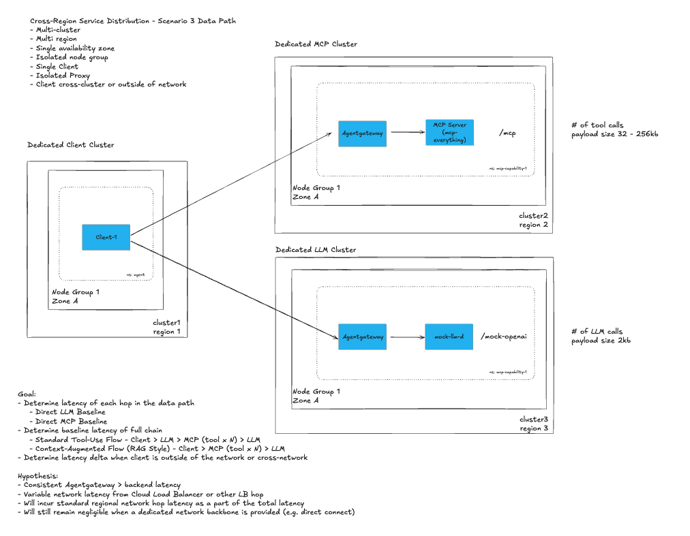

## Difference from Scenario 1a

| | Scenario 1a | Scenario 3 |
|-|-------------|-------------|
| Client connects via | `agentgateway-proxy` cluster DNS (internal) | LoadBalancer external IP |
| NLB hop measured | No — short-circuited by kube-proxy | Yes |
| Gateway | 1 shared `agentgateway-proxy` (unchanged) | 1 shared `agentgateway-proxy` (unchanged) |
| HTTPRoutes | `/mcp`, `/mock-openai` (unchanged) | `/mcp`, `/mock-openai` (unchanged) |

---

## Client Deployment Options

### Option 1 — Local (laptop -> internet -> NLB)
Measures: gateway overhead + internet latency + NLB

### Option 2 — Separate k8s cluster (cluster-B -> NLB)
Measures: gateway overhead + NLB (no internet variance). The setup script lists all available `kubectl` contexts and lets you pick the client cluster. If you pick the same context as the gateway cluster, kube-proxy will short-circuit the NLB and you'll get the same result as 1a.

---

## Components

| Component | Replicas | Notes |
|-----------|----------|-------|
| `agent` | 1 | Locust load test client |
| `agentgateway` | 2 | Handles `/mcp` and `/mock-openai` — unchanged from 1a |
| `mcp-server-everything` | 3 | Reference MCP server |
| `mock-llm-d` | 1 | Mock OpenAI-compatible LLM inference service (llm-d-inference-sim) |
| `prometheus` | 1 | Metrics |
| `grafana` | 1 | Dashboards |

---

## Prerequisites

Complete the following steps before running this scenario:

1. Create the GKE clusters — follow [`gke/main-cluster-gke.md`](../gke/main-cluster-gke.md) (Cluster 1 / server) and [`gke/external-client-cluster-gke.md`](../gke/external-client-cluster-gke.md) (Cluster 2 / client)
2. [001 - Set Up Enterprise AgentGateway](../scenario-1a/installation-steps/001-set-up-enterprise-agentgateway.md)
3. [002 - Set Up Monitoring Tools](../scenario-1a/installation-steps/002-set-up-monitoring-tools.md)

> **Coming from Scenario 2?** See [`installation-steps/005-reconfigure-for-scenario-3.md`](./installation-steps/005-reconfigure-for-scenario-3.md) for instructions and scripts to convert an existing Scenario 2 deployment to Scenario 3.

Additionally ensure the following are available:
- `kubectl` configured against the target cluster
- `helm`, `jq`, `curl`, Python 3.11+

---

## Quick Start

```bash
chmod +x setup-script.sh
./setup-script.sh
```

---

## Test Steps

1. Scale the MCP deployment:

   ```bash
   kubectl scale -n ai-platform deploy/mcp-server-everything --replicas 3
   ```

   The client connects via the LoadBalancer external IP — the NLB hop is included in all measurements.

2. **Option A — Local mode** (laptop -> internet -> NLB -> gateway):
   - Streamlit UI launched by `setup-script.sh` at `http://localhost:8501`
   - `GATEWAY_IP` is pre-set to the LB IP by the script.

3. **Option B — k8s mode** (separate cluster -> NLB -> gateway):

   ```bash
   kubectl --context <client-context> port-forward -n agent-1 svc/loadgen-client 8501:8501
   ```

4. Configure the Streamlit UI:
   - **Gateway IP / Host**: `<LoadBalancer external IP>` (pre-filled by `setup-script.sh`)
   - **Gateway Port**: `8080`
   - **MCP Path**: `/mcp`
   - **LLM Path**: `/mock-openai`

5. Run the load test with the following parameters:
   - 50 concurrent users
   - Spawn rate: 5 users/s
   - Duration: 300 seconds (5 mins)

6. Execute the following test scenarios:
   - **Direct LLM Baseline** (1x LLM call) — LLM Payload size: 256 B
   - **Direct MCP Baseline** (1x MCP tool call) — MCP Payload Size: 32 KB
   - **Full Chain — Standard Tool Use Flow**: 1x LLM call + 2x MCP Tool Calls + 1x LLM call — MCP Payload Size: 32 KB
   - **Full Chain — Context-Augmented Flow** (RAG style): 2x MCP tool calls + 1x LLM call — MCP Payload Size: 32 KB

7. After each test, rollout restart the backend servers:

   ```bash
   kubectl rollout restart -n ai-platform deployment mcp-server-everything
   kubectl rollout restart -n ai-platform deployment mock-llm
   ```

---

## Results

**Test Parameters:**
- 50 VU (25 concurrent users per client, 50 total across both clients)
- Spawn rate: 5 users/s
- Duration: 300 seconds (5 mins)
- LLM Payload size: 256 B
- MCP Payload Size: 32 KB

**Test Scenarios:**
- AGW > LLM Baseline (1x LLM call)
- AGW > MCP Baseline (1x MCP tool call)
- Full Chain
    - Standard Tool Use Flow: 1x LLM call + 2x MCP Tool Calls + 1x LLM call
    - Context-Augmented Flow (RAG style): 2x MCP tool calls + 1x LLM call

### Same-Zone GKE Results

#### Agentgateway to LLM Baseline (5-min)

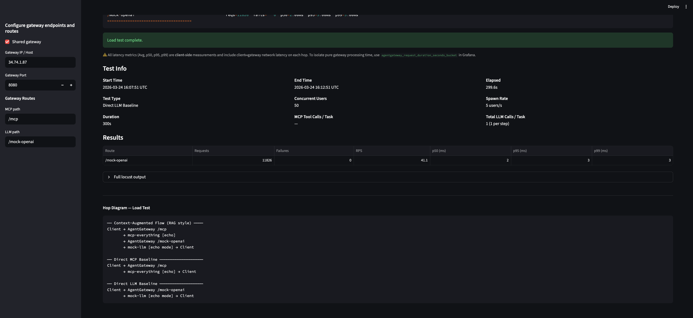
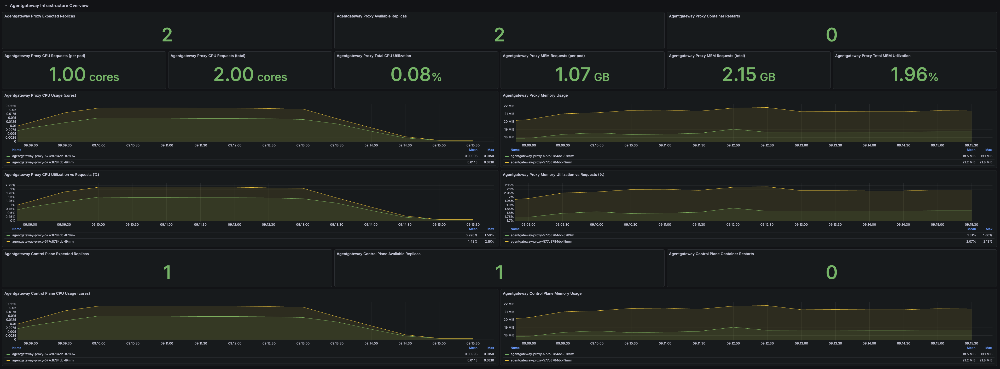
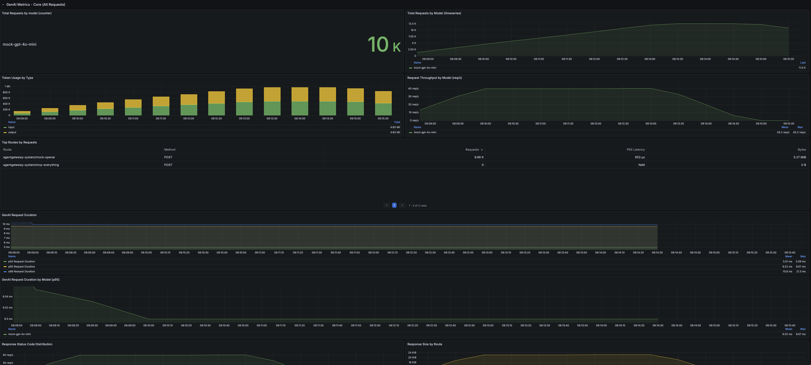

| Endpoint | Reqs | Fails | p50 | p95 | p99 |
|----------|------|-------|-----|-----|-----|
| /mock-openai | 11,826 | 0 | 2ms | 3ms | 3ms |

**Duration:** 4m 59s (2026-03-24 16:07:51 UTC → 2026-03-24 16:12:51 UTC)

**Results compared to Scenario 1a** — Minimal latency add (1-2ms) when traversing over the cloud provider's backplane is expected

| | p50 | p95 | p99 |
|---|---|---|---|
| Client in-network of gateway | 2ms | 2ms | 3ms |
| Client external to gateway (different cluster / same zone gke) | 2ms | 3ms | 3ms |

#### Agentgateway to MCP Baseline (5-min)

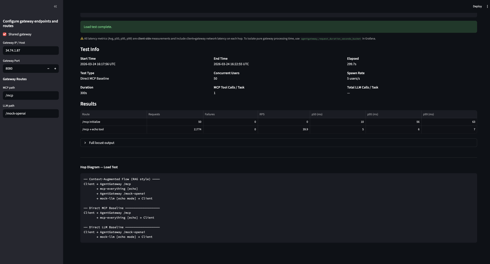
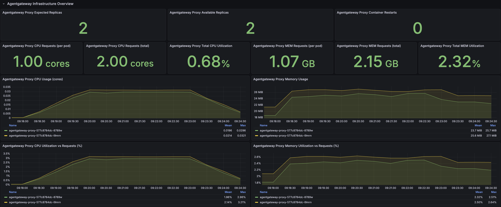
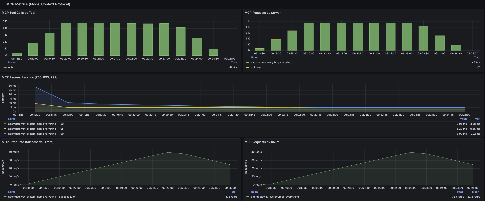

| Endpoint | Reqs | Fails | p50 | p95 | p99 |
|----------|------|-------|-----|-----|-----|
| /mcp initialize | 50 | 0 | 10ms | 56ms | 63ms |
| /mcp → echo tool | 11,774 | 0 | 5ms | 6ms | 7ms |

**Duration:** 4m 59s (2026-03-24 16:17:56 UTC → 2026-03-24 16:22:55 UTC)

**Results compared to Scenario 1a** — Minimal latency add (1-2ms) when traversing over the cloud provider's backplane is expected

| | p50 | p95 | p99 |
|---|---|---|---|
| Client in-network of gateway | 4ms | 5ms | 6ms |
| Client external to gateway (different cluster / same zone gke) | 5ms | 6ms | 7ms |

#### Full Chain - Standard Tool Use Flow (5 mins)

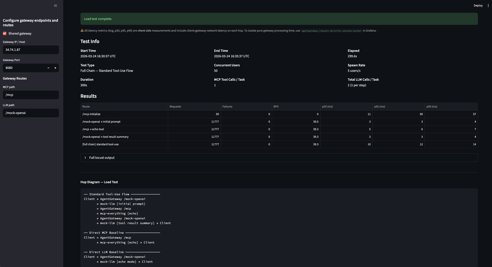
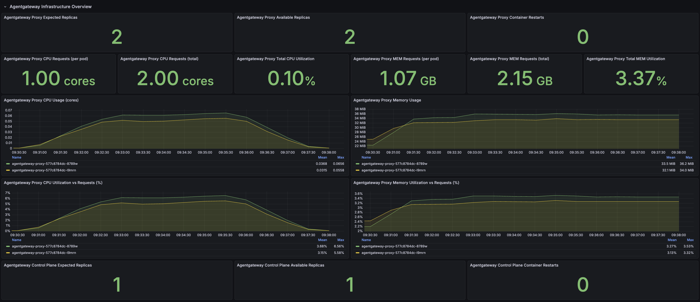
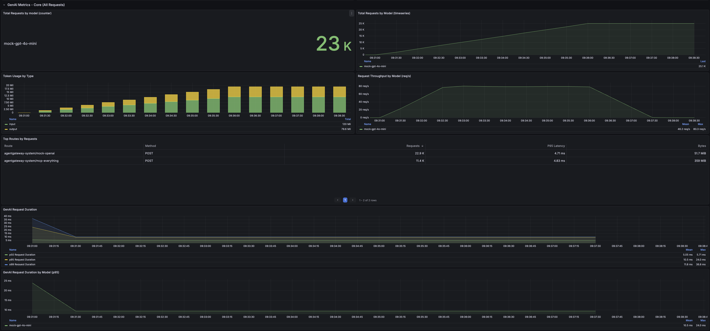
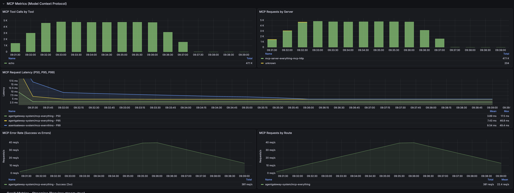

| Endpoint | Reqs | Fails | p50 | p95 | p99 |
|----------|------|-------|-----|-----|-----|
| /mcp initialize | 50 | 0 | 11ms | 50ms | 57ms |
| /mock-openai → initial prompt | 11,777 | 0 | 3ms | 3ms | 4ms |
| /mcp → echo tool | 11,777 | 0 | 5ms | 6ms | 7ms |
| /mock-openai → tool result summary | 11,777 | 0 | 3ms | 3ms | 4ms |
| [full chain] standard tool-use | 11,777 | 0 | 10ms | 12ms | 14ms |

**Duration:** 4m 59s (2026-03-24 16:30:37 UTC → 2026-03-24 16:35:37 UTC)

**Results compared to Scenario 1a** — Minimal latency add (1-2ms) when traversing over the cloud provider's backplane is expected; round trip effects can compound if running multiple LLM/MCP tool calls

| | p50 | p95 | p99 |
|---|---|---|---|
| Client in-network of gateway | 8ms | 10ms | 12ms |
| Client external to gateway (different cluster / same zone gke) | 10ms | 12ms | 14ms |

#### Full Chain - Context-Augmented Flow (5 mins)

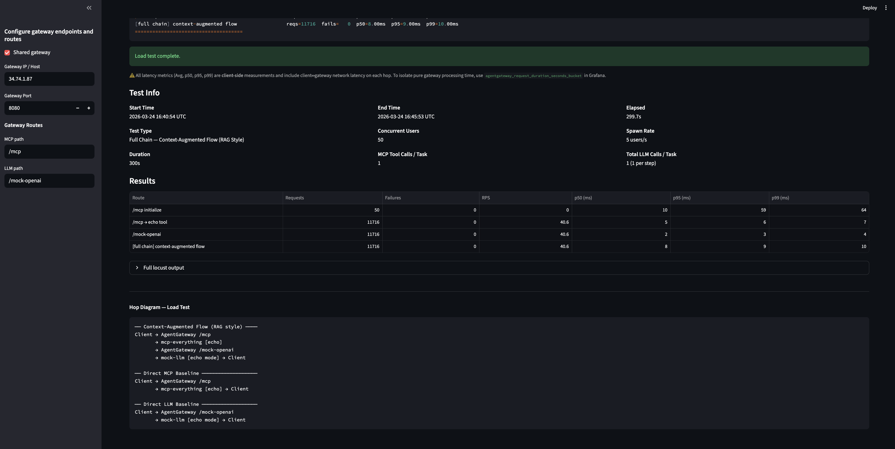
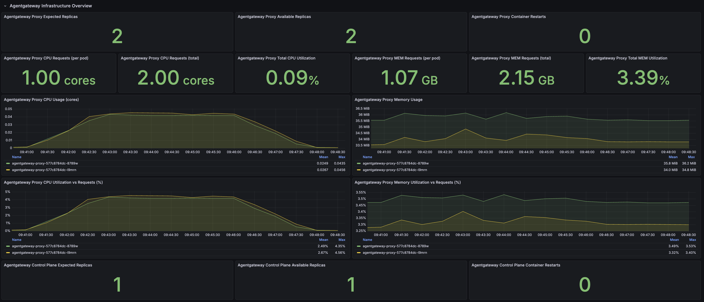
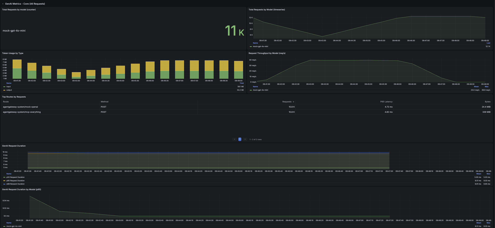
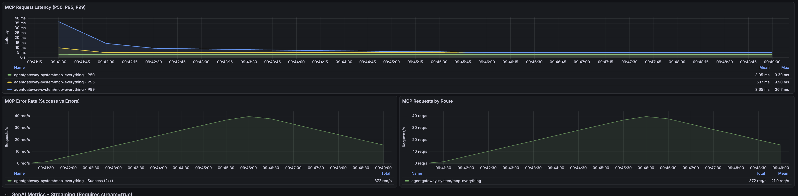

| Endpoint | Reqs | Fails | p50 | p95 | p99 |
|----------|------|-------|-----|-----|-----|
| /mcp initialize | 50 | 0 | 10ms | 59ms | 64ms |
| /mcp → echo tool | 11,716 | 0 | 5ms | 6ms | 7ms |
| /mock-openai | 11,716 | 0 | 2ms | 3ms | 4ms |
| [full chain] context-augmented flow | 11,716 | 0 | 8ms | 9ms | 10ms |

**Duration:** 4m 59s (2026-03-24 16:40:54 UTC → 2026-03-24 16:45:53 UTC)

**Results compared to Scenario 1a** — Minimal latency add (1-2ms) when traversing over the cloud provider's backplane is expected; round trip effects can compound if running multiple LLM/MCP tool calls

| | p50 | p95 | p99 |
|---|---|---|---|
| Client in-network of gateway | 6ms | 8ms | 9ms |
| Client external to gateway (different cluster / same zone gke) | 8ms | 9ms | 10ms |

### External (venv) Results

#### Agentgateway to LLM Baseline (5-min)


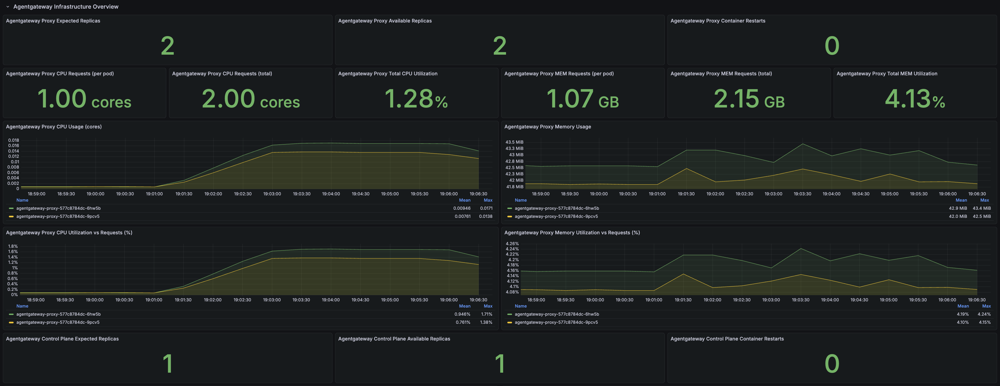
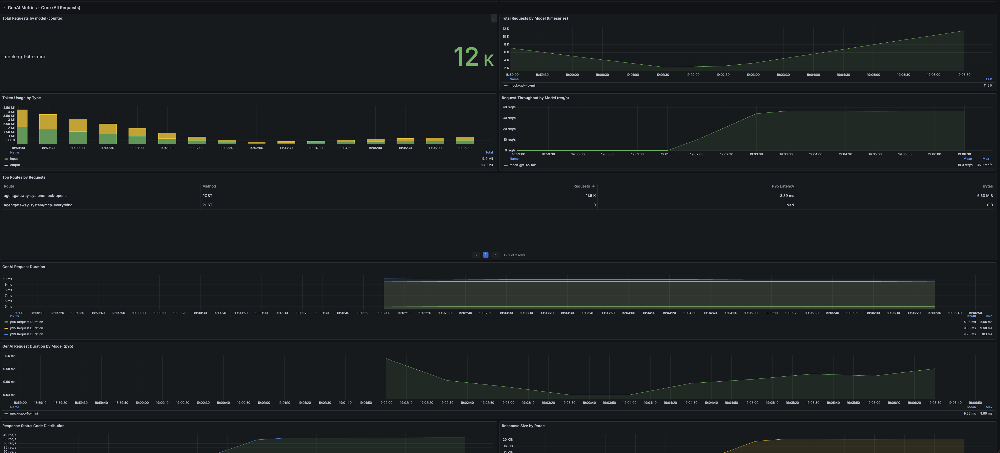

| Endpoint | Reqs | Fails | p50 | p95 | p99 |
|----------|------|-------|-----|-----|-----|
| /mock-openai | 10,825 | 0 | 97ms | 170ms | 190ms |

**Duration:** 4m 59s (2026-03-24 02:01:04 UTC → 2026-03-24 02:06:03 UTC)

**Results compared to Scenario 1a** — Public → External load balancer hop cost included in the call chain can be significant

| | p50 | p95 | p99 |
|---|---|---|---|
| Client in-network of gateway | 2ms | 2ms | 3ms |
| Client external to gateway | 97ms | 170ms | 190ms |

#### Agentgateway to MCP Baseline (5-min)


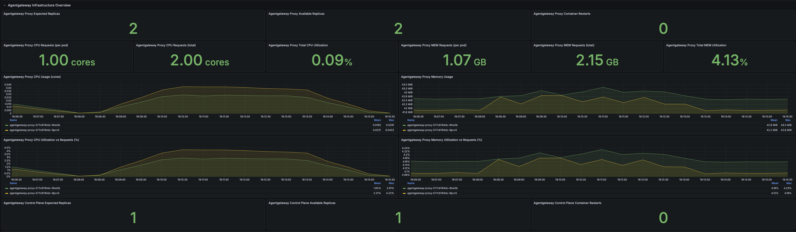
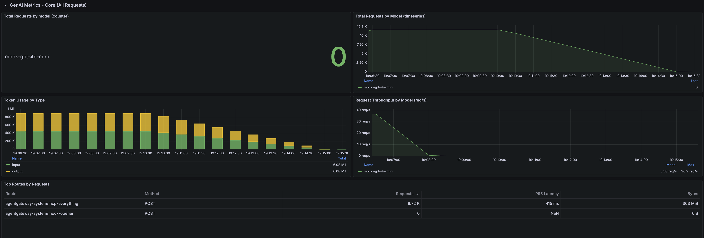

| Endpoint | Reqs | Fails | p50 | p95 | p99 |
|----------|------|-------|-----|-----|-----|
| /mcp initialize | 50 | 0 | 220ms | 290ms | 290ms |
| /mcp → echo tool | 9,444 | 0 | 270ms | 640ms | 720ms |

**Duration:** 4m 58s (2026-03-24 02:08:13 UTC → 2026-03-24 02:13:12 UTC)

**Results compared to Scenario 1a** — Public → External load balancer hop cost included in the call chain can be significant

| | p50 | p95 | p99 |
|---|---|---|---|
| Client in-network of gateway | 4ms | 5ms | 6ms |
| Client external to gateway | 270ms | 640ms | 720ms |

#### Full Chain - Standard Tool Use Flow (5 mins)

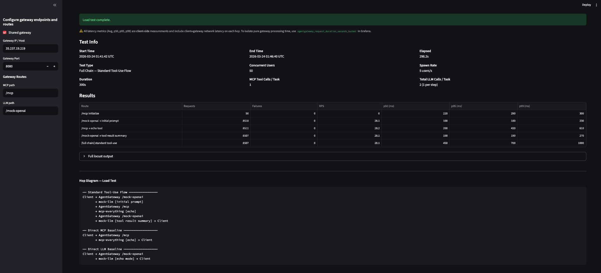
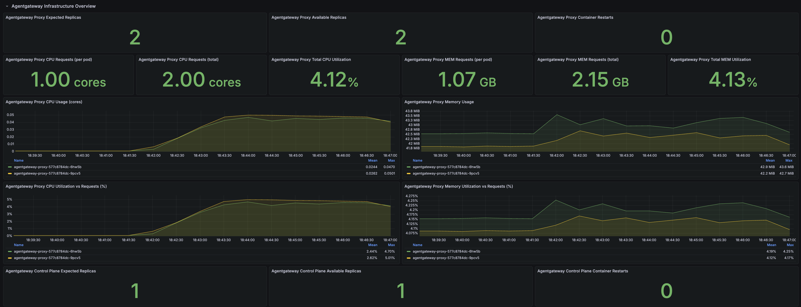
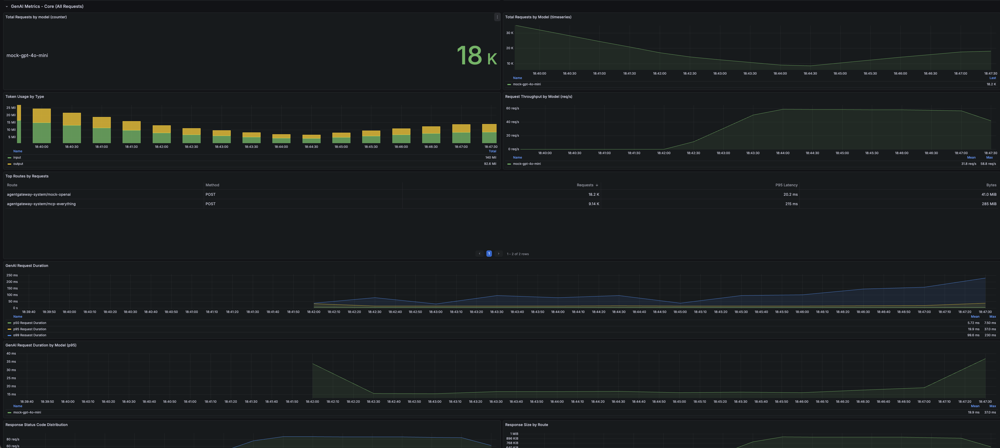
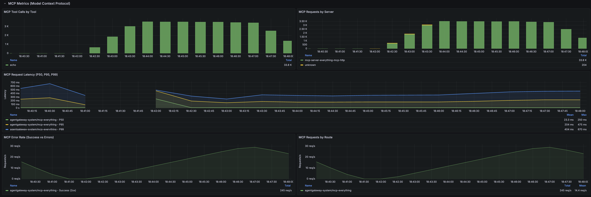

| Endpoint | Reqs | Fails | p50 | p95 | p99 |
|----------|------|-------|-----|-----|-----|
| /mcp initialize | 50 | 0 | 220ms | 290ms | 300ms |
| /mock-openai → initial prompt | 8,518 | 0 | 100ms | 180ms | 230ms |
| /mcp → echo tool | 8,511 | 0 | 200ms | 430ms | 610ms |
| /mock-openai → tool result summary | 8,507 | 0 | 100ms | 190ms | 270ms |
| [full chain] standard tool-use | 8,507 | 0 | 450ms | 700ms | 1000ms |

**Duration:** 4m 58s (2026-03-24 01:41:42 UTC → 2026-03-24 01:46:40 UTC)

**Results compared to Scenario 1a** — Public → External load balancer hop cost included in the call chain can be significant

| | p50 | p95 | p99 |
|---|---|---|---|
| Client in-network of gateway | 8ms | 10ms | 12ms |
| Client external to gateway | 450ms | 700ms | 1000ms |

#### Full Chain - Context-Augmented Flow (5 mins)


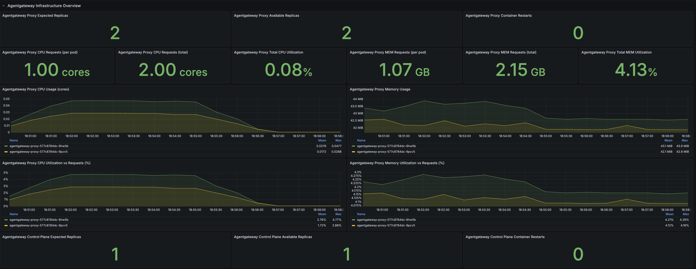


| Endpoint | Reqs | Fails | p50 | p95 | p99 |
|----------|------|-------|-----|-----|-----|
| /mcp initialize | 50 | 0 | 230ms | 290ms | 290ms |
| /mcp → echo tool | 8,733 | 0 | 270ms | 580ms | 1100ms |
| /mock-openai | 8,730 | 0 | 100ms | 180ms | 200ms |
| [full chain] context-augmented flow | 8,730 | 0 | 370ms | 700ms | 1300ms |

**Duration:** 4m 58s (2026-03-24 01:49:48 UTC → 2026-03-24 01:54:47 UTC)

**Results compared to Scenario 1a** — Public → External load balancer hop cost included in the call chain can be significant

| | p50 | p95 | p99 |
|---|---|---|---|
| Client in-network of gateway | 6ms | 8ms | 9ms |
| Client external to gateway | 370ms | 700ms | 1300ms |

---

## Observability

- Output from Streamlit / Locust summary tables
- Grafana Dashboards (same dashboard as Scenario 1a — no changes required)
- Prometheus metrics

---

## File Structure

```
scenario-3/
├── README.md
├── setup-script.sh
├── cleanup.sh
├── k8s/
│   ├── agent-deployment.yaml           # Single client (agent-1), GATEWAY_IP patched at deploy time
│   ├── mcp-everything-deployment.yaml  # Unchanged from 1a
│   └── mock-llm-deployment.yaml        # Unchanged from 1a
├── images/                             # Locust & Grafana screenshots for test results
│   ├── same-zone-gke/
│   └── venv/
├── installation-steps/
│   ├── 005-reconfigure-for-scenario-3.md      # Migration from scenario-2
│   ├── reconfigure-for-scenario-3.sh          # Automated migration script
│   └── lib/observability/
│       └── agentgateway-grafana-dashboard-v1.json  # Unchanged from 1a
└── route/
    ├── mock-openai-httproute.yaml    # Unchanged from 1a
    ├── mock-openai-backend.yaml      # Unchanged from 1a
    ├── mcp-everything-httproute.yaml # Unchanged from 1a
    └── mcp-everything-backend.yaml   # Unchanged from 1a
```
